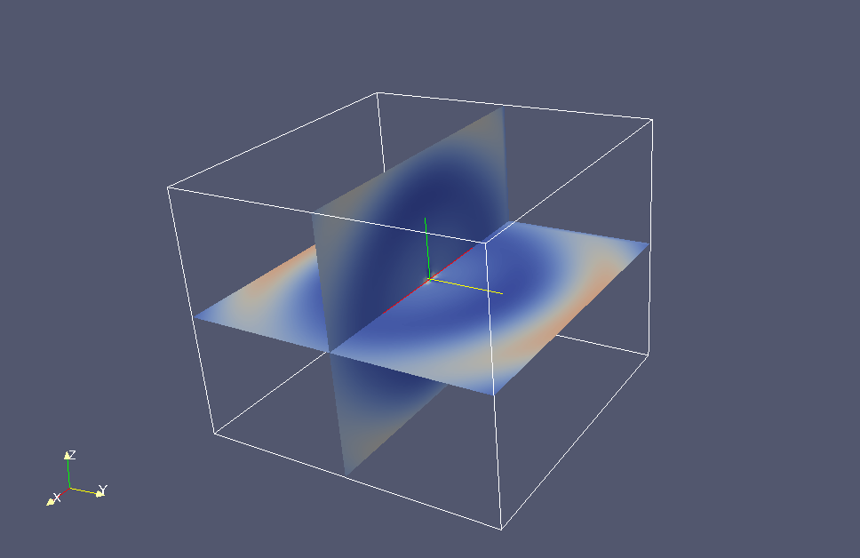

Free space Yee scheme with CRBC example (Fortran and C mix)
===========================================================

Similar to the waveguide case, instead of setting boundaries to CRBC_PEC, one should set all 6 faces to be CRBC_CRBC::

  d->boundaries[CRBC_XLeft]  = CRBC_CRBC;
  d->boundaries[CRBC_XRight] = CRBC_CRBC;
  d->boundaries[CRBC_YLeft]  = CRBC_CRBC;
  d->boundaries[CRBC_YRight] = CRBC_CRBC;
  d->boundaries[CRBC_ZLeft]  = CRBC_CRBC;
  d->boundaries[CRBC_ZRight] = CRBC_CRBC;

the *external_c_code.c* in :download:`ToyFDTD_CRBC.tar.gz<ToyFDTD_CRBC.tar.gz>` has been tested working with fortran Yee scheme solver as well. The function ended with underscore '_' is by default used by fortran code. Due to the copyright, we only put fortran code pieces here, just to illustrate how to use CRBC library.

Compile Fortran Yee scheme with CRBC library
---------------------------------------------

The CRBC library is written in C++/C, the *external_c_code.c* can be used an example of interface function between Fortran and C. The compiling process might look like::

  setenv yeecrbc_DIR ~/YeeCRBC/lib
  gfortran -C -c -fno-align-commons YeeSolver.f
  gcc -c -L$(yeecrbc_DIR) -I$(yeecrbc_DIR)/../include/crbc -lyeecrbc -lgfortran  external_c_codes.c
  g++ -C  -o run.x YeeSolver.o -L$(yeecrbc_DIR) -I$(yeecrbc_DIR)/../include/crbc external_c_codes.o -lyeecrbc -lgfortran

Call CRBC library in Fortran
----------------------------

We declare a integer type variable in fortran to hold the C pointer to CRBC library::

  integer cptr

Before the main time iteration, we call crbc_init() to initialize the CRBC library in fortran::

  call crbc_init(cptr,dx,dy,dz,nx,ny,nz,mxx+1,mxy+1,mxz+1,nt,dt,cc)

nx,ny,nz are number of cubic Yee cells along each axis. nt is total number of time iterations. mxx+1,mxy+1,mxz+1 stand for leading dimension for Ex,Ey,Ez field. In this case, the E and H field in fortran is defined as follows::

  real*8 e(0:mxx,0:mxy,0:mxz,3)
  real*8 h(0:mxx,0:mxy,0:mxz,3)

Before the end of the time iteration, usually at the place where you used to call PML the last time, we call::

  call computeBoundary(e,cptr)

to compute the CRBC. We can also export solution in VTK format::

  call writeefield(e,cptr,vtkfilename)

Due to the string difference in fortran and C, one should add a space ' ' at the end of vtkfilename string.

Setup CRBC for fortran Yee solver
---------------------------------

CRBC initialization is done in crbc_init_()::

  d->boundaries[CRBC_XLeft]  = CRBC_CRBC;
  ...

delta, low_index[], high_index[] are set in setup_crbc_(). Meaning of those variables are discussed in detail in Waveguide Yee scheme section. In the current setting, we assume source is in the middle of domain, and Yee cells looks like

.. _fig_yee_cell1:
.. figure:: cell1.png
  :align: center
  :figwidth: 120 %
  :width: 100 %
  :alt: image of a Yee cell

Output
------

Here are some pictures of electromagnetic waves leave the domain without reflection using Fortran Yee solver with CRBC.

.. _fig_Free:
.. figure:: F11.png
.. figure:: F12.png

.. figure:: F14.png
   
