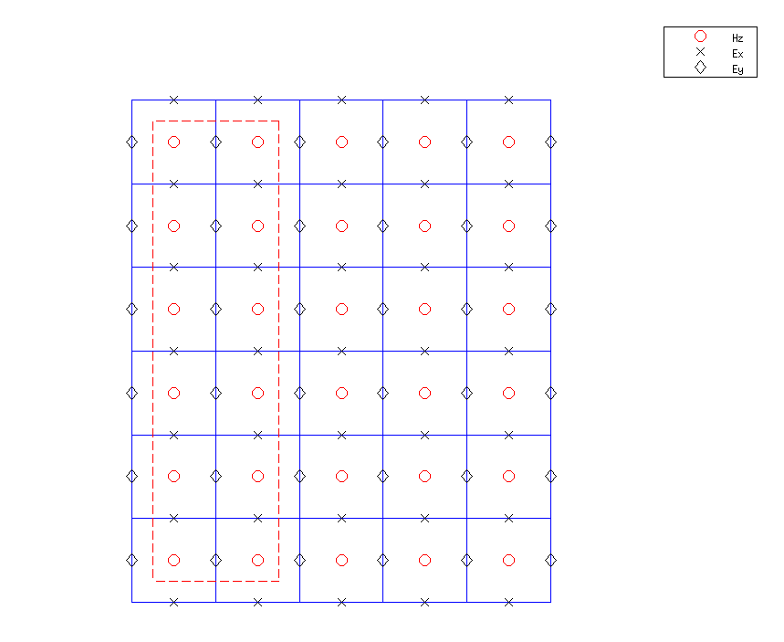
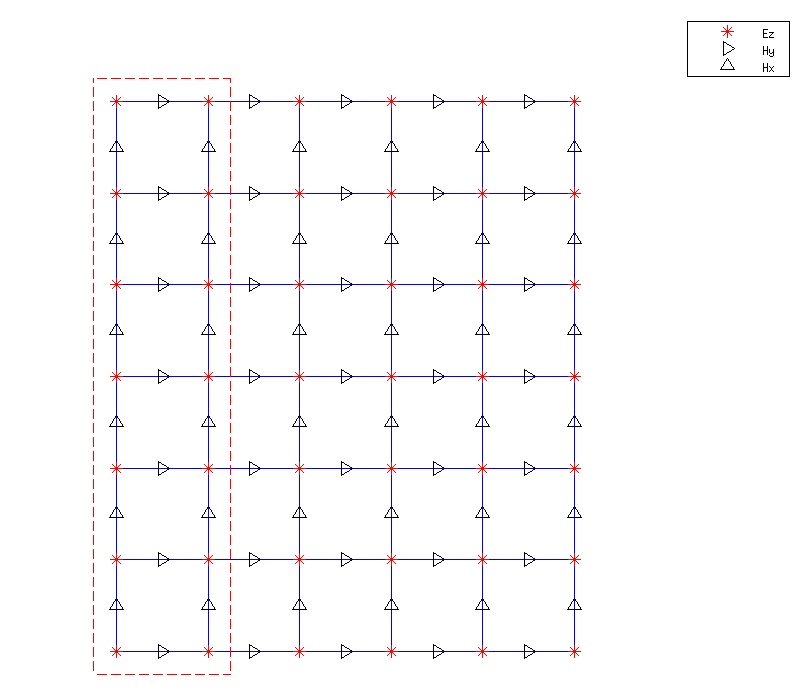

Transverse-Electromagnetic Example Interfacing the DAB/CRBC library with an External Yee Scheme 
===============================================================================================

Using the transverse electric code `2D FDTD, TE, (with Berenger PML ABC), 4/2/08`
found on `dougneubauer.com/fdtd/ <http://dougneubauer.com/fdtd/>`_ as an example
of an existing code base, we demonstrate how to add the DAB library functionality.

The original file can be download at `<http://dougneubauer.com/wp-content/uploads/wdata/taflove2d/yee2d_c.txt>`_. 
The modified version with DAB library can be download at :download:`2D_TE.tar.gz<2D_TE.tar.gz>`.
To compile and run the program(specify the location of CRBC library i.e. the directory containing libyeecrbc.a)::

  setenv yeecrbc_DIR ~/YeeCRBC/lib
  make
  ./yee2d.x

It will generate some data files that can be viewed using the Matlab *viewdata.m*
routine provided in the *2D_TE.tar.tz* file, which should looks like the following:

.. raw:: html

  

    <iframe width="600" height="450" src="https://www.youtube.com/embed/XwpxSt0ffpA" frameborder="0" allowfullscreen></iframe>
  

Modification to the code
------------------------

The point is to use DAB library as the nonreflecting outgoing boundary instead of
the PML, thus first we comment out all PML related parts in the code alternatively
the PML code could be left intact and we could put a switch to select between the 
PML and DAB library.  

We add CRBC header file to the yee2d.c: ::

  #include <2d_crbc_api.h>

We add two user-defined functions at the beginning of the original code.::

  setup_crbc()
  computeBoundary()

In the main code, before the time iteration, we initialize the CRBC::

  CRBC2d_Boundaries_t crbc_boundaries[4];

  crbc_boundaries[CRBC2d_XLeft]  = CRBC2d_CRBC;
  crbc_boundaries[CRBC2d_XRight] = CRBC2d_CRBC;
  crbc_boundaries[CRBC2d_YLeft]  = CRBC2d_CRBC;
  crbc_boundaries[CRBC2d_YRight] = CRBC2d_CRBC;

  CrbcUpdater2d *crbc_boundary_updater=setup_crbc(crbc_boundaries,ie,je,nmax,dt,dx,cc);

In this case, all 4 sides are set to be CRBC boundary. "ie,je" are the number of
grid points along x and y axis. "nmax" is the number of time iteration. "dt,dx" 
are the grid spacing size in time and space, "cc" is the propagation speed, which 
has to be consistent with "dt". For example, if "dt" is in seconds, and "cc" is 
the speed of light in m/s.

After the computation of all field variables, we call the routine computeBoundary
to compute the DAB/CRBC updates ::

  //***********************************************************************
  //     Update magnetic fields (HZ) in main grid
  //***********************************************************************
  for (i = 0; i < ie; i++) { 
    for (j = 0; j < je; j++) {
      hz[i][j] = dahz[i][j] * hz[i][j] + dbhz[i][j] * ( ex[i][j+1] - ex[i][j] + ey[i][j] - ey[i+1][j] );
    } /* jForLoop */     
  } /* iForLoop */     

  hz[is][js] = source[n];

  computeBoundary(hz,crbc_boundaries,crbc_boundary_updater); 

Parameter Setup
---------------

In setup_crbc()::

  crbc_boundary_updater = CRBC2d_new_updater_tol(crbc_T,crbc_h,dt,cc,crbc_boundaries,crbc_Pmax,crbc_tol);

means to use crbc_tol to determine the CRBC order but not exceed crbc_Pmax. One 
can also directly specify the CRBC order using CRBC2d_new_updater_p().

The distances from the source to the 4 CRBC boundaries are defined in::

  crbc_delta
  
which should be in the same unit as "dx". This is required to garantee error bound 
and longterm stability.

The Yee(modified) solver communicates with CRBC library through 2 layers of data, the indices of those are defined in ::

  crbc_low_index[];
  crbc_high_index[];

For example, on Xleft side, CRBC libary need all Hz field data from the red dotted-circled cells.
Thus, the indices for those data along x-axis are 0 and 1 defined in crbc_low_index[0] 
and crbc_high_index[0]; along y-axis are from 0 to je-1 defined in crbc_low_index[1] and 
crbc_high_index[1]. Note that this is slightly different from the TM case, where 
CRBC is imposed on Ez field. User can change those indices as along as they form 
a "box" of CRBC boundary, the CRBC library will just work fine.

.. _fig_2D_TE:

   TE Maxwell communicate with CRBC library.

.. _fig_2D_TM:

   TM Maxwell communicate with CRBC library.

More Information
----------------

For more details of TM case, please refer to :doc:`../yee_TM`.

