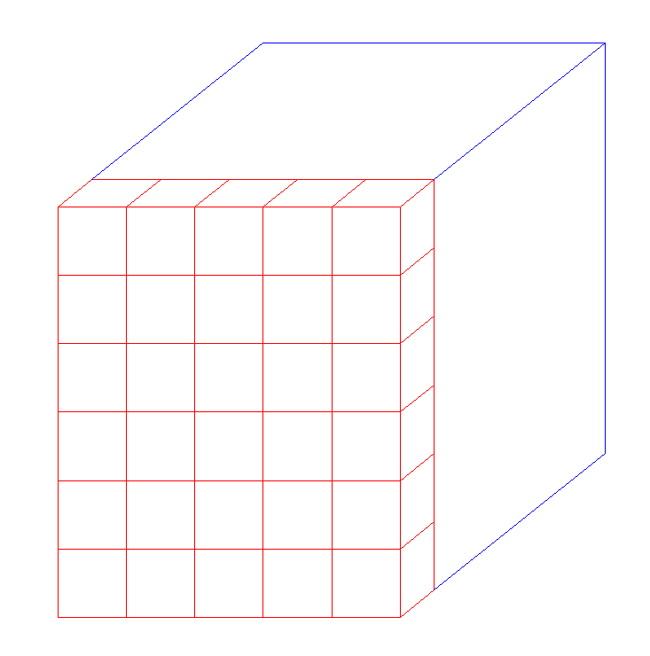
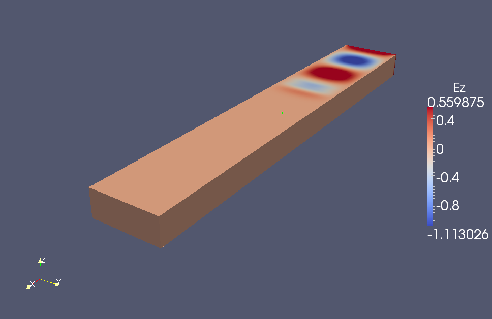
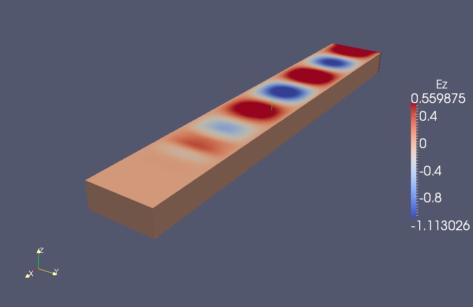
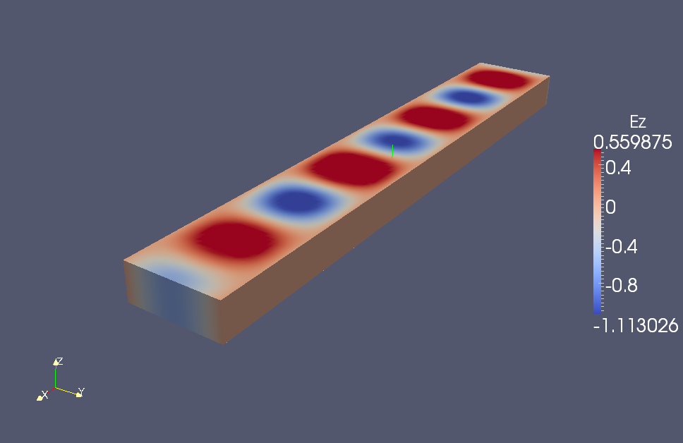
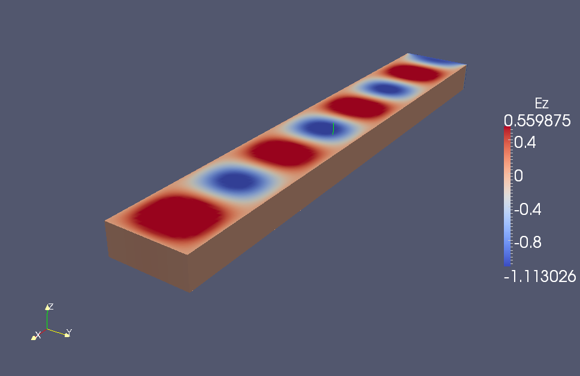

Waveguide Yee scheme with CRBC example
======================================

We use `ToyFDTD2 <http://dougneubauer.com/wp-content/uploads/wdata/toyfdtd/ToyFDTD2.html>`_ as an example. The original file can be download at `here <http://dougneubauer.com/wp-content/uploads/wdata/toyfdtd/toyfdtd2_c.txt>`_. The modified version with CRBC can be download at :download:`ToyFDTD_CRBC.tar.gz<ToyFDTD_CRBC.tar.gz>`.

Instead of rewriting the original ToyFDTD2 file, we write a seperate file called *external_c_codes.c* to control most of the CRBC setting and user-defined functions.

To compile and run the program(specify the location of CRBC library i.e. containing libyeecrbc.a)::

  setenv yeecrbc_DIR ~/YeeCRBC/lib
  make
  ./run.x

Use CRBC library in the Yee scheme
-----------------------------------

The CRBC libary is initialized right before the time iteration::

  void *ptr_crbc;
  crbc_init(&ptr_crbc,dx,dy,dz,nx,ny,nz,ioff_ex,ioff_ey,ioff_ez, MAXIMUM_ITERATION, dt, LIGHT_SPEED);
  char vtkfilename[256];
  FILE *f;

  for(iteration = 0; iteration < MAXIMUM_ITERATION; iteration++)
      {// mainloop
      ...
      }

Basic information if passed from Yee Scheme solver to CRBC through crbc_init(). All CRBC related information can be accessed through pointer ptr_crbc. ioff_ex, ioff_ey, ioff_ez defines the leading dimension of the E field arrays, since in the ToyFDTD2, the Ex, Ey, Ez file are defined as the following::

  #define Ex(I,J,K) ex[ioff_ex*(I) + (nz+1)*(J) + (k)]
  #define Ey(I,J,K) ey[ioff_ey*(I) + (nz+1)*(J) + (k)]
  #define Ez(I,J,K) ez[ioff_ez*(I) + nz*(J) + (k)]
  
  off_ex = (ny+1)*(nz+1);
  ioff_ey = ny*(nz+1);
  ioff_ez = (ny+1)*nz;
  
  ex = calloc(nx*(ny+1)*(nz+1),sizeof(double));
  ey = calloc((nx+1)*ny*(nz+1),sizeof(double));
  ez = calloc((nx+1)*(ny+1)*nz,sizeof(double));

The actual computation of the CRBC is done at the end of the time iteration::

  computeboundary(ex,ey,ez,&ptr_crbc);
  }// end mainloop

We add variable vtkfilename to hold the filenames for VTK files output, and use writeefield() to write the VTK files to the disk. Those utility functions are defined in external_c_codes.c, to use them::

  sprintf(vtkfilename,"CRBC_%08d_Ez.vtk",iteration);         
  writeefield(ex,ey,ez,3,&ptr_crbc,vtkfilename);

Setup CRBC
------------

In external_c_codes.c, we need to set at which we are going to apply CRBC. This is done in crbc_init()::

  d->boundaries[CRBC_XLeft]  = CRBC_PEC;
  d->boundaries[CRBC_XRight] = CRBC_CRBC;
  d->boundaries[CRBC_YLeft]  = CRBC_PEC;
  d->boundaries[CRBC_YRight] = CRBC_PEC;
  d->boundaries[CRBC_ZLeft]  = CRBC_PEC;
  d->boundaries[CRBC_ZRight] = CRBC_PEC;

In this case, only the X+ side is an open end, the rest of the boundaries are all PEC. If we want to do a free space scattering problem, we just need to change all boundaries to 'CRBC_CRBC'. In order to obtain a reliable error bound for long time simulation, the CRBC library need to know the total time(=MAXIMUM_ITERATION*dt) and the initial distance from the source to the CRBC faces. The latter is set in setup_crbc()::

  // Now set up the faces. Start by looping over all of the possible faces. We
  // follow the order given in CRBC_Side, so 
  //   l = 0 --> CRBC_XLeft
  //   l = 1 --> CRBC_XRight
  //   l = 2 --> CRBC_YLeft
  //   l = 3 --> CRBC_YRight
  //   l = 4 --> CRBC_ZLeft
  //   l = 5 --> CRBC_ZRight
  for (l=0; l<6; ++l) {
  
  // First we need to calculate the minimum distance between the boundary and
  // source. Since we placed the source in the center of the domain, this is 
  // simple. If it is not possible to calculate this directly, using a lower
  // bound for the seperation is the safest thing to do, but it may result
  // in more work being done that is actually needed to achieve the desired 
  // accuracy.
  switch (l / 2) {
  
  case 0: // Faces with a normal in the x-direction
  delta = (d->imax / 1.0) * (d->dx);
  break;
  
  case 1: // faces with a normal in the y-direction
  delta = (d->jmax / 2) * (d->dy);
  break;
  
  case 2: // faces with a normal in the z-direction
  delta = (d->kmax / 2) * (d->dz);
  break;
  }

The Yee(modified) solver communicates with CRBC library through one layers of data, and those indices are defined in::

  crbc_low_index[];
  crbc_high_index[];

Those indices define for every CRBC face, every component of E field(Ex,Ey,Ez), the Yee cell data to communicate iwth CRBC library. That is all the E field component on the Yee cell layer at which we are going to apply CRBC.

.. _fig_3D:

   One layer of Yee cell data to communicate with CRBC library.

On each Yee cell, the field variables are defined as usual shown below.

.. _fig_yee_cell:
.. figure:: cell.png
  :align: center
  :figwidth: 500 px
  :width: 450 px
  :alt: image of a Yee cell

  Spatial configuration of a Yee cell.

Note that one has to be careful with and modify those indices, especially when sometimes indices starts from 1 instead of 0 and/or the E and H field are defined different than above.

Outputs
-------

The output VTK files(view in paraview) at different time should look like

.. _fig_WG:

   One open end wavguide using CRBC library.
