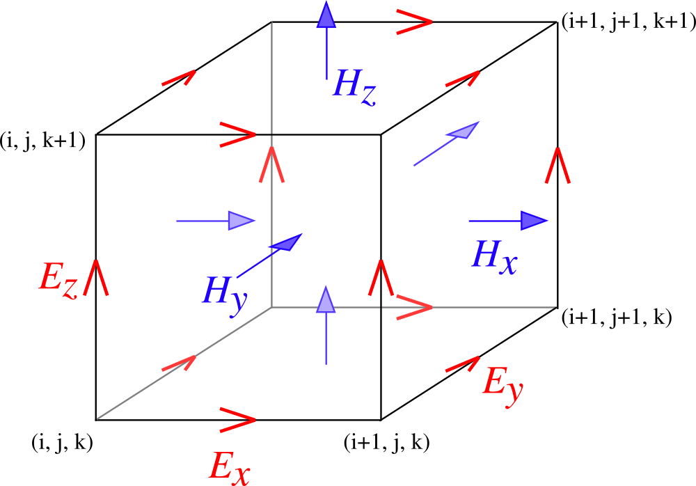

.. highlight:: c

*********************************************************
3-D FDTD code with CRBC/DAB Boundary Conditions using MPI
*********************************************************

This tutorial explains the code contained primarily in the files 
`yee_mpi.cpp <https://bitbucket.org/rbcpack/rbcpack/src/default/YeeCRBC/examples/yee_mpi/yee_mpi.cpp>`_,
`yee_mpi.hpp <https://bitbucket.org/rbcpack/rbcpack/src/default/YeeCRBC/examples/yee_mpi/yee_mpi.hpp>`_,
and `yee_mpi_example.cpp <https://bitbucket.org/rbcpack/rbcpack/src/default/YeeCRBC/examples/yee_mpi/yee_mpi_example.cpp>`_.

.. raw:: html

  

    <button type="button" class="close" data-dismiss="alert">&times;</button>
    <h4>Warning!</h4>
    
This code is meant to serve as an example of how the CRBC/DAB library
       might be used in conjunction with MPI. We are not officially supporting
       MPI at this time, but we will try to answer related questions if we are
       able.    
    

    
This code has also experienced unexplained deadlock/stalling issues in
       testing. We believe that this may have been caused by memory and network
       problems, but have not been able to verify this theory. If you experience
       issues or find a bug, please contact John LaGrone at "jlagrone at smu dot edu".
      
    

  

Introduction
============

This code implements the finite difference time-domain solution of
Maxwell's equations (curl formulation) over a 3-D Cartesian lattice.
The grid is terminated using Double Absorbing Boundaries (DAB).

Before beginning, it would be a good idea to understand the serial implementation
of the :doc:`3D Yee Scheme <3D_Yee_example_in_C>`. The 
:doc:`C++ wave equation example <wave_eq_example_in_Cpp>` may also be helpful in
understanding how the C++ library interface works.

What this program does
----------------------

At the global level, this program is meant to do exactly the same thing as the
serial example of the :doc:`3D Yee Scheme <3D_Yee_example_in_C>`, but here
we will divide the work among the available MPI processes.
We consider Maxwell's equations in a homogeneous, 
isotropic, dielectric material is given by

.. math::
  :nowrap:

  \begin{align}
    \frac{\partial \mathbf{H}}{\partial t} &= - \frac{1}{\mu}  \nabla \times \mathbf{E}, \\
    \frac{\partial \mathbf{E}}{\partial t}&= \frac{1}{\varepsilon} \nabla \times \mathbf{H},  
  \end{align}

subject to the constraints

.. math::
  :nowrap:

  \begin{align}
    \nabla \cdot \mathbf{E} &= 0, \\
    \nabla \cdot \mathbf{H} &= 0.
  \end{align}

.. _discretization:

To discretize these equations using Yee's scheme on a rectangular
domain :math:`[x_L, x_R] \times [y_L, y_R] \times [z_L, z_R]` with mesh spacings
of :math:`\Delta x`,  :math:`\Delta y`, and  :math:`\Delta z`, in the 
:math:`x`, :math:`y`, and :math:`z` directions, respectively, we define

.. math::
  :nowrap:

  \begin{align}
    x_i &= x_L + i\Delta x, \\
    y_j &= y_L + j\Delta y, \\
    z_k &= z_L + k\Delta z. 
  \end{align}

We choose a time step size, :math:`\Delta t`, satisfying

.. math::
  :nowrap:

  \begin{align}
    \Delta t \leq \frac{1}{c \sqrt{\frac{1}{(\Delta x)^2} + \frac{1}{(\Delta y)^2} + \frac{1}{(\Delta z)^2}}},
  \end{align}

with the wave speed given by

.. math::
  :nowrap:

  \begin{align}
    c = \frac{1}{\sqrt{\varepsilon \mu}}.
  \end{align}

Letting 

.. math::
  :nowrap:

  \begin{align}
    t_n = n \Delta t,
  \end{align}

the fields are approximated on the staggered space time grids:

.. math::
  :nowrap:

  \begin{align}
    E_x^{i+\frac{1}{2},j,k,n+\frac{1}{2}} & \sim E_x(x_{i+\frac{1}{2}},y_j,z_k,t_{n+\frac{1}{2}}), \\
    E_y^{i,j+\frac{1}{2},k,n+\frac{1}{2}} & \sim E_y(x_i,y_{j+\frac{1}{2}},z_k,t_{n+\frac{1}{2}}), \\
    E_z^{i,j,k+\frac{1}{2},n+\frac{1}{2}} & \sim E_z(x_i,y_j,z_{k+\frac{1}{2}},t_{n+\frac{1}{2}}), \\
    H_x^{i,j+\frac{1}{2},k+\frac{1}{2},n} & \sim H_x(x_i,y_{j+\frac{1}{2}},z_{k+\frac{1}{2}},t_n), \\
    H_y^{i+\frac{1}{2},j,k+\frac{1}{2},n} & \sim H_y(x_{i+\frac{1}{2}},y_j,z_{k+\frac{1}{2}},t_n), \\
    H_z^{i+\frac{1}{2},j+\frac{1}{2},k,n} & \sim H_z(x_{i+\frac{1}{2}},y_{j+\frac{1}{2}},z_k,t_n),
  \end{align}

where we require that the domain is terminated such that the tangential **E** 
components and the normal **H** component are located on the boundaries. This 
corresponds to having an integer number of Yee cells that match the 
illustrated :ref:`fig_yee_cell`

.. _fig_yee_cell:

   Spatial configuration of a Yee cell.

Finally, the fields are evolved with

.. math::
  :nowrap:

  \begin{align}
     H_x^{i,j+\frac{1}{2},k+\frac{1}{2},n+1}  = H_x^{i,j+\frac{1}{2},k+\frac{1}{2},n} 
     & +  \frac{\Delta t}{\mu \Delta z} \left(E_y^{i,j+\frac{1}{2},k+1,n+\frac{1}{2}} 
     - E_y^{i,j+\frac{1}{2},k,n+\frac{1}{2}} \right) \\
     & - \frac{\Delta t}{\mu \Delta y} \left(E_z^{i,j+1,k+\frac{1}{2},n+\frac{1}{2}} 
     - E_z^{i,j,k+\frac{1}{2},n+\frac{1}{2}}    \right),  \nonumber \\
     % % % %
     H_y^{i+\frac{1}{2},j,k+\frac{1}{2},n+1}  = H_y^{i+\frac{1}{2},j,k+\frac{1}{2},n}
     & + \frac{\Delta t}{\mu \Delta x} \left(E_z^{i+1,j,k+\frac{1}{2},n+\frac{1}{2}} 
     - E_z^{i,j,k+\frac{1}{2},n+\frac{1}{2}} \right) \\
     & -  \frac{\Delta t}{\mu \Delta z} \left(E_x^{i+\frac{1}{2},j,k+1,n+\frac{1}{2}} 
     - E_x^{i+\frac{1}{2},j,k,n+\frac{1}{2}} \right), \nonumber \\
     % % % %
     H_z^{i+\frac{1}{2},j+\frac{1}{2},k,n+1}  = H_z^{i+\frac{1}{2},j+\frac{1}{2},k,n} 
     & +  \frac{\Delta t}{\mu \Delta y} \left(E_x^{i+\frac{1}{2},j+1,k,n+\frac{1}{2}} 
     - E_x^{i+\frac{1}{2},j,k,n+\frac{1}{2}}\right)    \\
     & -  \frac{\Delta t}{\mu \Delta x} \left(E_y^{i+1,j+\frac{1}{2},k,n+\frac{1}{2}} 
     - E_y^{i,j+\frac{1}{2},k,n+\frac{1}{2}} \right), \nonumber \\
     % % % % %
     E_x^{i+\frac{1}{2},j,k,n+\frac{1}{2}}  = E_x^{i+\frac{1}{2},j,k,n-\frac{1}{2}}  
     & + \frac{\Delta t}{\varepsilon \Delta y} \left(H_z^{i+\frac{1}{2},j+\frac{1}{2},k,n}
     - H_z^{i+\frac{1}{2},j-\frac{1}{2},k,n} \right)  \\
     & - \frac{\Delta t}{\varepsilon \Delta z}  \left(H_y^{i+\frac{1}{2},j,k+\frac{1}{2},n} 
     - H_y^{i+\frac{1}{2},j,k-\frac{1}{2},n}\right),  \nonumber \\
     % % % % %
     E_y^{i,j+\frac{1}{2},k,n+\frac{1}{2}}  = E_y^{i,j+\frac{1}{2},k,n-\frac{1}{2}} 
     & + \frac{\Delta t}{\varepsilon \Delta z}  \left(H_x^{i,j+\frac{1}{2},k+\frac{1}{2},n} 
     - H_x^{i,j+\frac{1}{2},k-\frac{1}{2},n}\right) \\
     & - \frac{\Delta t}{\varepsilon \Delta x}  \left(H_z^{i+\frac{1}{2},j+\frac{1}{2},k,n} 
     - H_z^{i-\frac{1}{2},j+\frac{1}{2},k,n} \right),  \nonumber \\
     % % % % %
     E_z^{i,j,k+\frac{1}{2},n+\frac{1}{2}}  = E_z^{i,j,k+\frac{1}{2},n-\frac{1}{2}} 
     & + \frac{\Delta t}{\varepsilon \Delta x}  \left(H_y^{i+\frac{1}{2},j,k+\frac{1}{2},n} 
     - H_y^{i-\frac{1}{2},j,k+\frac{1}{2},n} \right)   \\
     & - \frac{\Delta t}{\varepsilon \Delta y}  \left(H_x^{i,j+\frac{1}{2},k+\frac{1}{2},n} 
     - H_y^{i,j-\frac{1}{2},k-\frac{1}{2},n} \right).  \nonumber
  \end{align}

We will use initial conditions generated from a Gaussian point source.

Class Declaration and Code Structure
====================================

First we briefly describe the definition of the `yee_updater` class that is declared
in header file `yee_mpi.hpp <https://bitbucket.org/rbcpack/rbcpack/src/default/YeeCRBC/examples/yee_mpi/yee_mpi.hpp>`_. 

Include files
-------------

First we include the most generic C++ interface to the CRBC/DAB boundary
conditions ::

  #include "crbc_updates.hpp"

We include the header file for an exact solution routine so we can generate initial
conditions and calculate errors ::

  // Header file for exact solution routines
  #include "solutions.hpp"

Next we include the standard template library vectors and arrays to minimize the
amount of memory we have to directly manage ::

  // for std::vector
  #include <vector>

  // for std::array
  #include <array>

Finally, we include the Message Passing Interface library ::

  // include MPI for parallel implementation
  #include <mpi.h>

yee_updater class declaration
-----------------------------

For simplicity, we declare a C++ class assuming that the number of processes will
be a perfect cube and the domain will also be a cube. The primary inputs will be
an MPI communicator, the number of processes to use, the width of the domain, the
grid spacing, simulation time, and DAB parameters. The remaining inputs are
primarily to modify the solution and output parameters. ::

  class yee_updater
  {
  public:

    /// constructor
    /// \param[in] comm      MPI communicator
    /// \param[in] nprocs    the number of processes to use in each direction
    /// \param[in] w         the approximate domain width (may be changed slighty due to discretization)
    /// \param[in] n         number of grid points
    /// \param[in] T         the total simulation time
    /// \param[in] CRBC_T    CRBC time parameter (usually CRBC_T = T)
    /// \param[in] CRBC_P    the number of CRBC recursions
    /// \param[in] io_t      approximately how often to generate output
    /// \param[in] skip      the stride to use when sampling errors
    /// \param[in] eps       permittivity
    /// \param[in] mu        permeability
    /// \param[in] gamma     roughty 1/variance of the Gaussian pulse used for ICs
    /// \param[in] tau       how far in the past the source pulse was turned on (> 0)
    /// \param[in] dab_wt    weight factor for DAB in load balancing 
    yee_updater(MPI_Comm comm,          
              const int &nprocs,     
	      const double &w,        
	      const int &n,        
	      const double &T,        
	      const double &CRBC_T,   
	      const int &CRBC_P, 
              const double &io_t = 0.05,
              const int &skip = 1,    
	      const double &eps = 1.0,      
	      const double &mu  = 1.0,
              const double &gamma = 160.0,
              const double &tau = 0.35,
              const int &dab_wt = 3);

    virtual ~yee_updater();

Next we declare the remaining public functions. Notably, a function to run the
simulation and one to free any memeroy associated with the MPI communicators.
We also declare functions to print out some information about memory usage and
timing data. ::
 
  /// run the simulation
  void run();

  /// free the communicators created internally
  void free_comms();

  /// function to display the approximate memory usage in MB
  void print_mem_use() const;

  /// function to display timing information
  void print_timing_data() const;

We declare most of the data structures we will use in the following. Here, we 
have everything that was in the serial example and we additionally have more
arrays to store indexing and relational information for each of the MPI processes
as well as buffers for the send and receives. We use std::vectors here so we don't
have to worry about freeing memory. :: 

  private:

    // storage for field values
    std::vector<double> E[3], H[3];

    double Hcoef, Ecoef;

    // storage for mpi messages. The lengths correspond to worst case situations
    std::vector<double> E_sbuf[6]; 
    std::vector<double> E_rbuf[6];
    std::vector<double> E_edge_sbuf[12];
    std::vector<double> E_edge_rbuf[12];
    std::vector<double> DAB_sbuf[6];
    std::vector<double> DAB_rbuf[6];
    std::vector<double> DAB_corner_sbuf[12];
    std::vector<double> DAB_corner_rbuf[12];

    double eps, mu, gamma, tau, io_t, c;
    double T, dt, h, Etime, Htime;
    double tol, CRBC_T;
    double coord[3], domain_width;
    int nprocs, nprocs_cubed;
    int nx, ny, nz;
    int maxn;
    int ntsteps;
    int skip;
    int dab_wt;
    bool isBoundaryProc;
    crbc::BoundaryProperties::Boundary procBounds[6];
    int MPI_DIR[6];
    int my_id, cart_rank[3];
    std::vector<int> MPI_EDGE_DIR;
    std::vector<int> send_dirs, send_mpi_dirs, send_sides[4], corner_mpi_dirs[12];
    std::array<int, 3> send_corners[12];
    std::vector< std::array<int, 2> > send_edges;
    crbc::CrbcUpdates<3, double, int> bound_upd[3];
    MPI_Comm grid_comm, glob_comm;
    std::vector<MPI_Request> send_req, recv_req;
    std::vector<MPI_Request> DAB_send_req, DAB_recv_req;
    std::vector<int> DAB_props, rDAB_props;
    std::vector<double> DAB_refl, rDAB_refl;
    double create_comm_t,  alloc_mem_t, init_dab_t, step_E_t, step_inner_H_t, \
         step_outer_H_t, step_DAB_t, send_DAB_t, recv_DAB_t, send_E_t, \
         recv_E_t, sol_t, load_init_conds_t, calc_norm_t, calc_err_t, calc_params_t;

    double dab_mem_use;

    maxwell_solutions::MW_FreeSpace sol_obj;

The next set of functions are used to set up the problem. These functions will
try to load balance the problem (in a simple way), create the communicators, 
load initial conditions, and set up the boundary updaters. ::

  /// function to calculate parameters and do some basic load balancing
  void calc_params();

  /// function to create the internal mpi comm. It also labels the boundaries.
  void create_mpi_comm(MPI_Comm comm);

  /// function to set up the solution routines
  void init_solutions();

  /// load the initial conditions
  void load_initial_conds(); 

  /// function to allocate memory
  void allocate_memory();

  /// function that sets up the DAB boundary updaters
  void init_DAB();

The functions are essentially the same as the serial case and serve to update
the E and H fields. We split the H-field updates to be for interior and boundary
updates so we can do some updates while we wait for message passing to complete. ::

  /// evolve the E fields
  void step_E();

  /// evolve the interior H fields
  void step_inner_H();

  /// evolve the H fields on the process boundaries
  void step_outer_H();

  /// update the DAB layers
  void step_DAB();

  /// copy the DAB updates back into the interior
  void copy_DAB();

These functions are simply commonly used loops for copying data between the DAB
library and the interior of our domain. ::

  /// often used loop that copies data from the DAB to the interior
  void get_dab_vals_loop(std::vector<double> &buffer,
                         crbc::CrbcUpdates<3, double, int> &updater,
                         const int &side,
                         const int *low,
                         const int *high,
                         const int *plow,
                         const int *phigh,
                         const bool &isedge = false);

  /// often used loop that copies data from the interior to the DAB
  void set_dab_vals_loop(std::vector<double> &buffer,
                         crbc::CrbcUpdates<3, double, int> &updater,
                         int &count,
                         const int &side,
                         const int *low,
                         const int *high,
                         const int *plow,
                         const int *phigh,
                         const bool &isedge = false);

The bulk of the new code is in the following functions which handle the sending
and receiving of the MPI messages for the boundary values and the field values. ::

  /// function to indentify the sides and edges that need to be sent to update
  /// the DAB layer
  void calc_DAB_send_params();

  /// send DAB values between processes
  void send_DAB();
 
  /// recieve DAB values from neighboring processes
  void recv_DAB();
 
  /// send E field values to neighboring processes
  void send_E();

  /// recieve E field values form neighboring processes
  void recv_E();

Finally, we have functions to compute the norm and error of the solutions. ::

    /// calculate the norm at the current time 
    double calc_norm();
  
    /// calculate the error at the current time
    double calc_error();

Class Definitions
=================

The definitions for the `yee_updater` class are implemented in the file `yee_mpi.cpp <https://bitbucket.org/rbcpack/rbcpack/src/default/YeeCRBC/examples/yee_mpi/yee_mpi.cpp>`_. 

Includes
--------

We begin by including the header file containing the class declarations: ::

  #include "yee_mpi.hpp"

Next we include the routines needed to produce output and calculate the error and
norms ::

  // Needed for C++ output
  #include <iostream>

  // This has the declarations of the 'sqrt' and 'abs' functions
  #include <cmath>

  // We use this for std::accumulate
  #include <numeric>

Finally, we optionally include OpenMP to allow for threading ::

  // optional OpenMP
  #if USE_OPENMP
    #include <omp.h>
  #endif

Constructor
-----------

The primary function of the constructor is to set up all of the problem parameters.
It expects to receive the MPI communicator to use, the number of process to use
in each direction (`nprocs` is the side length, not the total number), the width
of the domain, the number of grid points, and the simulation time. It additionally
takes the DAB/CRBC time parameter (usually this should be the same as the simulation
time) and the number of recursions to use. The remaining parameters are optional and set the output time and sampling frequency and the solution parameters. There is also a parameter to adjust how to scale the
work in the DAB layers for load balancing purposes (in experiements choosing this 
to be 3-6 seems to work well in most cases). 

We copy these inputs and set all the timer variables to 0. Note that the majority
of the MPI barriers in this section of code are unnecessary and are only here
to try to help isolate potential problems in the code. ::

  yee_updater::yee_updater(MPI_Comm comm,          
                         const int &nprocs,     
	                 const double &w,        
	                 const int &n,        
	                 const double &T,        
	                 const double &CRBC_T,   
	                 const int &CRBC_P, 
                         const double &io_t, 
                         const int &skip,    
	                 const double &eps,      
	                 const double &mu,
                         const double &gamma,
                         const double &tau,
                         const int &dab_wt)
  {

    // save inputs
    this->T = T;
    this->CRBC_T = CRBC_T;
    this->CRBC_P = CRBC_P;
    domain_width = w;
    this->nprocs = nprocs;
    n_global = n;
    this->io_t = io_t;
    this->skip = skip;
    this->eps = eps;
    this->mu = mu;
    this->gamma = gamma;
    this->tau = tau;
    this->dab_wt = dab_wt;

    // compute the wave speed;
    c = 1.0 / std::sqrt(eps*mu); 

    // make a copy of the communicator
    MPI_Comm_dup(comm, &glob_comm);

    // initialize timers to 0
    calc_params_t = create_comm_t = alloc_mem_t = init_dab_t = step_E_t = \
                  step_inner_H_t = step_outer_H_t = step_DAB_t =  send_DAB_t = \
                  recv_DAB_t = send_E_t = recv_E_t = sol_t = load_init_conds_t = \
                  calc_norm_t = calc_err_t = 0.0;

Then, we set up a cartesian communicator and calculate the parameters for the 
simulation and load balancing. The functions :ref:`create_mpi_comm <sec:create_mpi_comm>`
and :ref:`calc_params <sec:calc_params>` are described in more detail below, but 
the basic idea is to create a topologically aware communicator so each process
knows its position in the domain and to try to distrubute the work to each process
in an equitable manner while taking into account the fact that the DAB updates 
are more expensive than the Yee updates. ::

  // create cartesian communicator
  create_mpi_comm(glob_comm);

  // calculate grid and time step size
  if (grid_comm != MPI_COMM_NULL) {
    try {
      calc_params();
    } catch (const std::exception& e) {
      std::cerr << "id = " << my_id 
        << " failed in calc_params() --- a standard exception was caught, with message '"
        << e.what() << "'" << std::endl;
      MPI_Abort(glob_comm, -2);
    } 

    // wait for all processes to finish calculating parameters
    MPI_Barrier(grid_comm);
  }

Next we allocate the bulk of the memory for the field values. Note that we do not
allocate the send and receive buffers here (it would be a good idea to do so). ::

  // allocate memory
  if (grid_comm != MPI_COMM_NULL) {
    try {
      allocate_memory();
    } catch (const std::exception& e) {
      std::cerr << "id = " << my_id 
        << " failed in allocate_memory() --- a standard exception was caught, with message '"
        << e.what() << "'" << std::endl;
      MPI_Abort(glob_comm, -2);
    } 
    
    // wait for all processes to finish allocating memory
    MPI_Barrier(grid_comm);
  }

We now initialize the boundary updater objects using the DAB library ::

  // initialize DAB updaters
  if (grid_comm != MPI_COMM_NULL) {
    try {
      init_DAB();
    } catch (const std::exception& e) {
      std::cerr << "id = " << my_id 
        << " failed in init_DAB() --- a standard exception was caught, with message '"
        << e.what() << "'" << std::endl;
      MPI_Abort(glob_comm, -2);
    } 
     
    // wait for all processes to set up DAB updaters (if needed)
    MPI_Barrier(grid_comm);
  }

Finally, we set up the solution routine. The solution we will use is described
in the :doc:`numerical results page <results>` and the code is availabe at 
`solutions.cpp <https://bitbucket.org/rbcpack/rbcpack/src/default/YeeCRBC/examples/yee_mpi/solutions.cpp>`_
and `solutions.hpp <https://bitbucket.org/rbcpack/rbcpack/src/default/YeeCRBC/examples/yee_mpi/solutions.hpp>`_. ::

  // set up the solution routine
  if (grid_comm != MPI_COMM_NULL) {
    try {
      init_solutions();
    } catch (const std::exception& e) {
      std::cerr << "id = " << my_id 
        << " failed in init_solutions() --- a standard exception was caught, with message '"
        << e.what() << "'" << std::endl;
      MPI_Abort(glob_comm, -2);
    } 
     
    // wait for all processes to set up solution routines
    MPI_Barrier(grid_comm);
  }

Routine to run the Simulation
-----------------------------

The following routine is responsible for running the actual simulation. It starts
by determining how many time steps to take between outputs and reserves memory
to save these outputs. Then the initial conditions are load and we calculate the
norm of the initial data so we can calculate relative errors later. ::

  void yee_updater::run()
  {

    double loc_norm, glob_norm, loc_err, glob_err;
    int tskip; 
    int tstep;
    std::vector<double> err;
    std::vector<double> time;

    // figure out how many time steps should be taken between outputs
    tskip = io_t/dt;

    // reserve memory for errors 
    if (my_id==0) {
      err.reserve((ntsteps / tskip) + 1);
      time.reserve((ntsteps / tskip) + 1);
    }
   
    // load initial conditions
    if (grid_comm != MPI_COMM_NULL) {
      try {
        load_initial_conds();
      } catch (const std::exception& e) {
        std::cerr << "id = " 
          << my_id << " failed in load_initial_conds() --- a standard exception was caught, with message '"
          << e.what() << "'" << std::endl;
        MPI_Abort(glob_comm, -2);
      } 
      MPI_Barrier(grid_comm);
    }

    // calculate norm of intitial conditions
    if (grid_comm != MPI_COMM_NULL) {
      try {
        loc_norm = calc_norm();
      } catch (const std::exception& e) {
        std::cerr << "id = " << my_id 
          << " failed in calc_norm() --- a standard exception was caught, with message '"
          << e.what() << "'" << std::endl;
          MPI_Abort(glob_comm, -2);
      } 
      MPI_Barrier(grid_comm);
    }

Next we collect the norm (squared) from each of the processes onto a single process
using MPI_Reduce. ::

  // use mpi_reduce to calculate global norm
  glob_norm = 0.0;
  if (grid_comm != MPI_COMM_NULL) {
    if (MPI_Reduce(&loc_norm, &glob_norm, 1, MPI_DOUBLE, MPI_SUM, 0, grid_comm) != MPI_SUCCESS)
      std::cerr << "MPI_Reduce failed, norm calculation" << std::endl;
  }
    
  if (my_id == 0) {
    glob_norm = std::sqrt(glob_norm);
  }

Next we actually run the simulation by time stepping. The idea here is that we 
have discretized the problem in such a way that we can update all of the internal
E-Field values, so we do that first. After the internal E-field values are updated
we send any values needed on the boundaries between processes and begin updating
exterior boundaries using the DAB library. We send the DAB values as soon as they are
available and then update the internal H-field while waiting to receive the E-field
needed to update the boundaries. After receiving the E-field and DAB updates from
neighboring processes, we update the H-fields along the boundaries. We repeat this
process and calculate the error at the requesting intervals until we reach the
final time. ::

  // time step
  if (grid_comm != MPI_COMM_NULL) {

    for (tstep = 0; tstep < ntsteps; ++tstep) {

      // generate output
      if (tstep % tskip == 0) {

        // calculate error
	loc_err = calc_error();

	glob_err = 0.0;

	if (MPI_Reduce(&loc_err, &glob_err, 1, MPI_DOUBLE, MPI_SUM, 0, grid_comm) != MPI_SUCCESS)
	  std::cerr << "MPI_Reduce failed, err calculation" << std::endl;

	if (my_id==0) {
	  std::cout << "tstep = " << tstep << "	T (E) = " << Etime 
	      << "	err = " << std::sqrt(glob_err)
              << "	rel err = " << std::sqrt(glob_err)/glob_norm << std::endl;
	  err.push_back(std::sqrt(glob_err));
	  time.push_back(Etime);
	}
      } // output

      // update E fields
      step_E();

      // Send the E fields
      send_E(); 

      // update the DAB
      step_DAB();

      // update the current E time
      Etime += dt;

      // Send the DAB values
      send_DAB();

      // update the H fields
      step_inner_H();

      // wait for the E field sends to complete
      recv_E();

      // wait for the DAB sends to complete
      recv_DAB();

      // get the updated boundary values from the DAB updaters
      copy_DAB();

      // update the boundary H fields
      step_outer_H();

      // increment H time
      Htime += dt;

      MPI_Barrier(grid_comm);

    } // end time stepping

Ater the time stepping is complete, we compute the error at the final time and
output all of the error data again in a comma seperated list that is easily 
imported into other programs. ::

    // calculate final error
    loc_err = calc_error();
  
    glob_err = 0.0;

    if (MPI_Reduce(&loc_err, &glob_err, 1, MPI_DOUBLE, MPI_SUM, 0, grid_comm) != MPI_SUCCESS)
      std::cerr << "MPI_Reduce failed, err calculation" << std::endl;

    if (my_id == 0) {
      err.push_back(std::sqrt(glob_err));
      time.push_back(Etime);

      std::cout << "tstep = " << tstep << "	T (E) = " << Etime 
	<< "	err = " << std::sqrt(glob_err)
        << "	rel err = " << std::sqrt(glob_err)/glob_norm << std::endl;
 
      std::cout << std::endl << std::endl;
	
      // print out all the errors again that are easier to import
      std::cout << "time, error, relative error," << std::endl;
      for (unsigned i=0; i<err.size(); ++i)
        std::cout << time[i] << ", " << err[i] << ", "  << err[i]/glob_norm 
          << std::endl;

Function to Free Communicators
------------------------------

To avoid memory leaks, we define a function to free the communicators. We note
that it may be better practice to have the class call MPI_Init and put the following
code along with a call to MPI_Finalize in the class destructor. ::

  void yee_updater::free_comms()
  {
    MPI_Comm_free(&glob_comm);
    MPI_Comm_free(&grid_comm);
  }

Function to Print Approximate Memory Usage
------------------------------------------

The following function is potentially useful in analyzing the load balancing and
reports a list of how much memory is used by each process. ::

  void yee_updater::print_mem_use() const 
  {
    if (grid_comm != MPI_COMM_NULL) {

      double tot_mem_use, dab_buff, ebuff, fields;

      // calculate the size of the field vectors in MB
      fields = sizeof(double)*(E[0].capacity() + E[1].capacity() + E[2].capacity() + 
          H[0].capacity() + H[1].capacity() + H[2].capacity()) / ((double) 1024*1024);

      // calculate the size of the E send/recieve buffers
      ebuff = 0;    
      for (int i=0; i<6; ++i)
        ebuff +=  sizeof(double)*(E_sbuf[i].capacity() + E_rbuf[i].capacity()) \
            / ((double) 1024*1024);

      // calculate the size of the DAB buffers
      dab_buff = 0;
      for (int i=0; i<6; ++i)
        dab_buff += sizeof(double)*(DAB_sbuf[i].capacity() + DAB_rbuf[i].capacity()) \
                / ((double) 1024*1024);

      // calculate total mem use (dab_mem_use is calculate in init_DAB())
      tot_mem_use = dab_buff + ebuff + fields + dab_mem_use;
  
      // colect everything on 1 process
      std::vector<double> send, recv;
      send.push_back(dab_buff);
      send.push_back(ebuff);
      send.push_back(fields);
      send.push_back(dab_mem_use);
      send.push_back(tot_mem_use);
      recv.assign(nprocs_cubed*5, 0.0);

      if (MPI_Gather(send.data(), 5, MPI_DOUBLE, recv.data(), 5, MPI_DOUBLE, 0, grid_comm) != MPI_SUCCESS)
        std::cerr << "MPI_Gather failed " << std::endl;

      if (my_id == 0) {

        std::cout << " , DAB Buffers, E Buffers, Fields, DAB, Total" << std::endl;
        for (int l=0; l<nprocs_cubed; ++l) {

          std::cout << "proc " << l << ", ";
          for (int i=0; i<5; ++i)
             std::cout << recv[5*l + i] << ", ";

          std::cout << std::endl;   
        }

        std::cout << "Total, ";
        for (int i=0; i<5; ++i) {
          double tot = 0;
          for (int l=0; l<nprocs_cubed; ++l)
            tot += recv[5*l + i];
          std::cout << tot << ", ";
        }
        std::cout << std::endl;
      } // end my_id == 0
    } // end if grid_comm != MPI_COMM_NULL
  } // end print_mem_use()

Function to Print Timing Data
-----------------------------

This function prints a list of time each process spends in certain sections of the
code both in seconds and as a percentage. The first table is the actual times
and the second table is the percentage of time spend in each section.
Note the row totals can be viewed as wall times and the column totals are CPU times.
Again, this function is potentially useful in analyzing the load balancing. ::

  void yee_updater::print_timing_data() const 
  {

    if (grid_comm != MPI_COMM_NULL) {

      std::vector<double> timers_send, timers_recv;

      timers_send.reserve(15);
      timers_recv.assign(15*nprocs_cubed, 0.0);

      // save all the local timers to a vector
      timers_send.push_back(calc_params_t);
      timers_send.push_back(create_comm_t);
      timers_send.push_back(alloc_mem_t);
      timers_send.push_back(init_dab_t);
      timers_send.push_back(step_E_t);
      timers_send.push_back(step_inner_H_t);
      timers_send.push_back(step_outer_H_t);
      timers_send.push_back(step_DAB_t);
      timers_send.push_back(send_DAB_t);
      timers_send.push_back(recv_DAB_t);
      timers_send.push_back(send_E_t);
      timers_send.push_back(recv_E_t);
      timers_send.push_back(load_init_conds_t);
      timers_send.push_back(calc_norm_t);
      timers_send.push_back(calc_err_t);

      // gather all timer data
      MPI_Gather(timers_send.data(), timers_send.size(), MPI_DOUBLE, timers_recv.data(), timers_send.size(), MPI_DOUBLE, 0, grid_comm);

      // print out timer data
      if (my_id == 0) {
        std::cout << std::endl << std::endl;
        std::cout << " ,"
		<< " Calculating Parameters,"
		<< " Creating Communicators,"
		<< " Allocating Memory,"
		<< " Initializing DABs,"
		<< " Stepping E,"
		<< " Stepping Inner H,"
		<< " Stepping Outer H,"
		<< " Stepping DAB,"
		<< " Sending DAB,"
		<< " Receiving DAB,"
		<< " Sending E,"
		<< " Receiving E,"
		<< " Loading Initial Condition,"
		<< " Calculating Norm,"
		<< " Calculating Error,"
		<< " Total "
		<< std::endl;

        timers_send.assign(16, 0.0);
        for (int i = 0; i<nprocs_cubed; ++i) {
	  double sum = std::accumulate(timers_recv.begin() + 15*i, timers_recv.begin() + 15*(i+1), 0.0);

          // print timer data for each process
	  std::cout << " process " << i << ",";
          for (int j=0; j<15; ++j)
            std::cout << timers_recv[15*i+j] << ",";
          std::cout << sum << std::endl;

          // update total times
          for (int j=0; j<15; ++j)
	    timers_send[j] += timers_recv[15*i + j];
	  timers_send[15] += sum;
        }

        std::cout << " Total " << ",";
        for (int j=0; j<15; ++j)
	  std::cout << timers_send[j] << ",";
        std::cout << timers_send[15] << std::endl << std::endl;

        // compute percentages 
        timers_send.assign(16, 0.0);
        for (int i = 0; i<nprocs_cubed; ++i) {
	  std::cout << " process " << i << ",";
          for (int j=0; j<15; ++j)
            std::cout << 100*timers_recv[15*i + j] / std::accumulate(timers_recv.begin() + 15*i, timers_recv.begin() + 15*i + 15, 0.0) << ",";
          std::cout << "100" << std::endl;

          // total percentages
          for (int j=0; j<15; ++j)
	    timers_send[j] += timers_recv[15*i+j] / std::accumulate(timers_recv.begin() + 15*i,   timers_recv.begin() + 15*i + 15, 0.0);
	  timers_send[15] += 1;
        }

        std::cout << " Average " << ",";
        for (int j=0; j<15; ++j)
          std::cout << 100*timers_send[j]/nprocs_cubed << ",";
        std::cout << std::endl << std::endl;
      } // end if id == 0
    } // end comm check
  } // end print_timing_data

.. _sec:calc_params:

Routine to Calculate Parameters
-------------------------------

The main purpose of this routine is to do some basic load balancing. The idea 
that using P auxilliary variables is roughly equal (in terms of FLOPS) to 
doing ~3*P Yee cell updates, so we will make the processes with DAB layers have
fewer Yee updates to compute but otherwise distribute the points as evenly as 
possible. Note that the difference between the DAB and Yee memory access patterns
probably plays a role here, but we're ignoring it.

Also note that we are overlaping the processor domains by a factor of h.
This is certainly less memory efficient, but it makes the message 
passing and updates a bit more straightforward.

We begin by defining the bottom left corner of the domain, which we assume to be
a cube centered around 0 and compute the grid spacing. ::

  void yee_updater::calc_params() 
  {

    int x, i, j, k, rem, n[3], P;
    double t1, t2;

    t1 = MPI_Wtime();  // start timer

    // use the requested number of recursoins
    P = CRBC_P;

    // compute the left-most point in each coordinate direction
    coord[0] = -domain_width/2.0;
    coord[1] = -domain_width/2.0;
    coord[2] = -domain_width/2.0;

    h = domain_width/((double) (n_global - 1.0));

Next, if we only have a single process we just compute the number of grid points
on that process by setting them to the number of points requested. ::

  if (nprocs == 1) {
    
    // if there's only 1 MPI process, we just compute the number of grid points
    // like normal
    for (i=0; i<3; ++i)
      n[i] = n_global;

Otherwise, we start by calculating the total number of "grid points" assuming that 
each additional auxilliary variable in the DAB counts for :math:`dab\_wt` grid 
points. We additionally assume that each of the exterior boundaries is in fact
a DAB, that is we assume the free space problem. We also assume the 
grid overlaps by a factor of h so processes share 2 grid points with their neighbors.
That is, we want the domain to look something like ::

       ......       ...........       ...........       ......
           ...........       ...........       ...........

So if we had a single process we would have n_global points plus there are 2 DABS,
which give :math:`2 \cdot P \cdot dab\_wt` points plus we have the extra points due to overlapping 
the grid, which gives :math:`2(nprocs-1)` points putting this all together, we get 
that we need a total of :math:`n\_global + 2 \cdot P \cdot dab\_wt + 2 \cdot nprocs -2`.
We try to divide this up evenly and calculate how many points are left over. ::

  } else {

    
    //
    // IMPORTANT:
    // This can fail by making processes have too few points on the boundary or
    // or even assigning a negative number of points on the boundary processes.
    // This isn't really accounted for, but we attempt to abort if we see it ...
    x = ((int) (n_global + 2*dab_wt*P + 2*(nprocs) - 2)) / nprocs;
    rem = ((int) (n_global + 2*dab_wt*P + 2*(nprocs) - 2)) % nprocs;

    // Next we allocate points to processes in each direction bases on whether
    // they are on the boundary or not
    for (i=0; i<3; ++i) {
      if ((cart_rank[i] == 0) || (cart_rank[i] == nprocs-1)) {

        // if the process is on the boundary, we subtract of dab_wt*P points
        // to account for the DAB layer. We additionally calculate the left
        // most coordinate in this direction. Note that on the left side, we 
        // have already correctly set this value so we only do it if it is the
        // right-most process
	n[i] = x - dab_wt*P;
	if (cart_rank[i] == nprocs-1) {
	  coord[i] += (x - dab_wt*P - 2)*h + (cart_rank[i]-1)*(x-2)*h;
	}
      } else {
 
        // otherwise, we just assign the number of points as is and calculate
        // the left-most point of the process in the current direction
	n[i] = x;
	coord[i] += (x - dab_wt*P - 2)*h + (cart_rank[i]-1)*(x-2)*h;
      }
    }

It is possible that the number of "points" generated above does not divide evenly
across the processes. In this case, we just loop over the interior processes and add one
point to the current process and adjust the physical coordinates of each process
until we have used all of the extra points. :: 

    // now account for any left over points
    if (nprocs == 2) {
      // if there are only 2 processes per direction, just add the extra point(s)
      // to the left process and shift the right process' coordinates accordingly.
      for (i=0; i<3; ++i)
	if (cart_rank[i] == 0) {
	  n[i] += rem;
	} else {
	  coord[i] += rem*h;
	}
    } else {
   
      // otherwise we only add extra points to the interior processes. We do 
      // this by looping over the interior processes from left to right and
      // add one to the current process and the coordinates by h for all of the
      // processes to the right and repeat until we have no remaining points.
      int r[3];
      r[0] = rem;
      r[1] = rem;
      r[2] = rem;

      // loop over the number of remaining points just to make sure we iterate
      // enough times
      for (k=0; k<rem; ++k) {
        // loop over the interior processes
	for (j=1; j<nprocs-1; ++j) {
          // loop over the directions
	  for (i=0; i<3; ++i) {
            // if we have points left, add one to the current process and shift
            // the process coordinates for the processes to the right
	    if (r[i] > 0) {
	      if (cart_rank[i] == j) {
		n[i]++;
	      }
	      if (cart_rank[i] > j)
		coord[i] += h;
	    }
            r[i]--;
	  }
	}
      } // end for k
    }
  }

Finally, we do a simple check to make sure that the grid partitioning is somewhat
reasonable in the sense that each process will have at least 1 internal point.
We also calculate the time step size and set the initial times. ::

  // do a basic check to make sure that the grid partitioning is somewhat 
  // reasonable
  if ((n[0] < 3) || (n[1] < 3) || (n[2] < 3)) {

    std::cerr << "Grid partitioning failed. Try increasing n, decrreasing dab_wt, and/or nprocs" << std::endl;
      MPI_Abort(glob_comm, -3);
  }

  // save the number of grid points in each direction
  nx = n[0];
  ny = n[1];
  nz = n[2];

  // calculate the time step size and number of time steps
  dt = 0.99 / sqrt(3.0/(h*h));
  ntsteps = T / dt;
  Etime = 0;
  Htime = dt/2.0;

  // update timer
  t2 = MPI_Wtime();
  calc_params_t += t2-t1;

.. _sec:create_mpi_comm:

Function to Create a MPI Communicator
-------------------------------------

This function creates a topologically aware MPI communicator and figures out the
neighbors and boundary conditions on each process. We start by creating the 
a Cartesian communicator using the build in MPI function. ::

  void yee_updater::create_mpi_comm(MPI_Comm comm) {
    int periods[3], i, j, diag_coords[3], diag_rank;
    periods[0] = 0; // not periodic
    periods[1] = 0;
    periods[2] = 0;
    int reorder = 1;
    double t1, t2;

    t1 = MPI_Wtime(); // start timer

    int dims[3];
    dims[0] = nprocs;
    dims[1] = nprocs;
    dims[2] = nprocs;

    nprocs_cubed = nprocs*nprocs*nprocs;
  
    // create a cartesian communicator with nprocs in each direction
    if (MPI_Cart_create(comm, 3, dims, periods, reorder, &grid_comm) != MPI_SUCCESS) {
      std::cerr << "MPI_Cart_create failed" << std::endl;
    }

Next we figure out the the neighboring processes in each direction using the MPI_Cart_shift
function. ::

  // figure out neighboring processes
  for (int i=0; i<6; ++i)
    MPI_DIR[i] = MPI_PROC_NULL;

  cart_rank[0] = -1;
  cart_rank[1] = -1;
  cart_rank[2] = -1;

  if (grid_comm != MPI_COMM_NULL) {
    if (MPI_Comm_rank(grid_comm, &my_id) != MPI_SUCCESS)
      std::cerr << "MPI_Comm_rank failed" << std::endl;

    if (MPI_Cart_coords(grid_comm, my_id, 3, cart_rank) != MPI_SUCCESS)
      std::cerr << "MPI_Cart_coords failed" << std::endl;

    // figure the ids of the processes we might need to send data to
    if (MPI_Cart_shift(grid_comm, 2, -1, &MPI_DIR[5], &MPI_DIR[4]) != MPI_SUCCESS)
      std::cerr << "MPI_Cart_shift failed" << std::endl;

    if (MPI_Cart_shift(grid_comm, 1, -1, &MPI_DIR[3], &MPI_DIR[2]) != MPI_SUCCESS)
      std::cerr << "MPI_Cart_shift failed" << std::endl;

    if (MPI_Cart_shift(grid_comm, 0, -1, &MPI_DIR[1], &MPI_DIR[0]) != MPI_SUCCESS)
      std::cerr << "MPI_Cart_shift failed" << std::endl;

  }

Then, we figure out which of the processes are on the boundary. We do this based
on whether or not the process has a neighbor, but it could also be done using the
coordinates of the processes on the Cartesian communicator. We are assuming the
free space problem, so in each direction we label the boundary to by type ``CRBC``
for exterior boundaries and ``NONE`` for interior boundaries shared with another
process. ::

  // figure out which processes are on the boundary
  isBoundaryProc = false;

  // if a process doesn't have a neighbor on at least 1 side, its on the boundary
  if ((grid_comm != MPI_COMM_NULL) && ((MPI_DIR[0] == MPI_PROC_NULL) || 
       (MPI_DIR[1] == MPI_PROC_NULL) || (MPI_DIR[2] == MPI_PROC_NULL) || 
       (MPI_DIR[3] == MPI_PROC_NULL) || (MPI_DIR[4] == MPI_PROC_NULL) || 
       (MPI_DIR[5] == MPI_PROC_NULL)))
    isBoundaryProc = true;

  // label the boundaries. Use type NONE for interior sides and CRBC for the
  // exterior boundaries. To do a wave guide, e.g., one might change the type
  // to DIR on the appropriate sides
  for (int i=0; i<6; ++i) {
    procBounds[i] = crbc::BoundaryProperties::NONE;
    if ((grid_comm != MPI_COMM_NULL) && (MPI_DIR[i] == MPI_PROC_NULL))
      procBounds[i] = crbc::BoundaryProperties::CRBC;
  }

Finalling, we figure out which edges are shared between processes so we can send
data diagonally to complete the edge updates. ::

  // figure out if we need to send any edge data diagonally
  if (grid_comm != MPI_COMM_NULL) {

    // loop over sides
    for (i=0; i<5; i++) {
      // get a second side to check
      for (j=i+1; j<6; j++) {
        // make sure the sides are not parallel
        if (j/2 != i/2) {
        
          if ((MPI_DIR[i] != MPI_PROC_NULL) && (MPI_DIR[j] != MPI_PROC_NULL)) {
            send_edges.push_back({i, j});

            // get rank of destination
            for (int l=0; l<3; ++l)
              diag_coords[l] = cart_rank[l];
            // shift coordinate for first side
            diag_coords[i/2] = (i%2 == 0) ? cart_rank[i/2]-1 : cart_rank[i/2]+1;
            // shift coordinate for second side
            diag_coords[j/2] = (j%2 == 0) ? cart_rank[j/2]-1 : cart_rank[j/2]+1;

            if (MPI_Cart_rank(grid_comm, diag_coords, &diag_rank) != MPI_SUCCESS)
              std::cerr << "MPI_Cart_rank failed" << std::endl;

            MPI_EDGE_DIR.push_back(diag_rank);
       
          }
        }
      }
    }
  }

  // stop timer
  t2 = MPI_Wtime();
  create_comm_t += t2-t1;

Function to Initialize Solutions
--------------------------------

Here, we define a function which initializes the solution routines. We simply 
provide a source location, which we place at (0,0,0) and we give it the grid 
spacing, material parameters, :math:`\mu` and :math:`\varepsilon`, and the 
parameters that determine the width and start time of the Gaussian pulse,
:math:`\gamma` and :math`\tau`. ::

  void yee_updater::init_solutions() 
  {
  
    double src_loc[3];
    double hloc[3];

    // place the source at (0,0,0)a small perturbation to decrease the 
    // chances of coinciding with a grid point may be needed. If the source is on a grid
    // point there is the possiblity of a division by zero in the solution 
    // routines
    src_loc[0] = 0.0;
    src_loc[1] = 0.0;
    src_loc[2] = 0.0;

    // set the grid spacing to be the same in all directions
    hloc[0] = h;
    hloc[1] = h;
    hloc[2] = h;

    // initialize the solution object
    sol_obj = maxwell_solutions::MW_FreeSpace(gamma, tau, eps, mu, src_loc);
    sol_obj.set_grid_spacing(hloc);

  }

Function to Allocate Memory
---------------------------

This function allocates memory for each of the field components. We note it would
likely be a good idea to allocate the send and receive buffers here as well. ::

  void yee_updater::allocate_memory()
  {

    int m;
    double t1, t2;

    // start timer
    t1 = MPI_Wtime();

    // figure out the largest number number of grid points possible
    m = (nx > ny) ? nx : ny;
    m = (m > nz) ? m : nz;
    if (MPI_Allreduce(&m, &maxn, 1, MPI_INT, MPI_MAX, grid_comm) != MPI_SUCCESS)
      std::cerr << "MPI_Allreduce failed";

    // allocate Fields and initialize to 0
    E[0].assign((nx-1)*ny*nz, 0.0);     // Ex
    E[1].assign(nx*(ny-1)*nz, 0.0);     // Ey
    E[2].assign(nx*ny*(nz-1), 0.0);     // Ez
    H[0].assign(nx*(ny-1)*(nz-1), 0.0); // Hx
    H[1].assign((nx-1)*ny*(nz-1), 0.0); // Hy
    H[2].assign((nx-1)*(ny-1)*nz, 0.0); // Hz

    // compute update coefficients
    Hcoef = (dt/mu)/h;
    Ecoef = (dt/eps)/h;

    // stop timer
    t2 = MPI_Wtime();
    alloc_mem_t += t2-t1;
  }

Function to Initilize the DAB Layer
-----------------------------------

The purpose of this function is to set up objects to provide the exterior 
boudnary updates using the DAB library. Again, we are assuming this is a free 
space problem, so we initialize DAB updaters for each of the 3 E-field components.
Note, in a wave guide, for example, where there are no DAB edges or corners, we only 
need updaters for the tangential components. There's no harm in having an updater
for the normal components when it's not needed, but it represents unnecessary work.

We overlap the DAB domains so that each process can update the information it needs
to continue with the DAB library. If we did not overlap the domains, we would need
to pass data used in the DAB library between neighboring processes at the wave equation
stage of the DAB update. This is possible to do, but it would require changing
the inner workings of the DAB library.

We start by creating storage for various properties of the DAB that we may want
to print out such as the error estimates. ::

  void yee_updater::init_DAB()
  {

    double delta;
    int l,m;
    int low[3], high[3];
    double htmp[3];
    htmp[0] = htmp[1] = htmp[2] = h;
    double t1, t2;

    // start timer
    t1 = MPI_Wtime();

    // storage for DAB boundary properties that we might want to print out or need
    // to use elsewhere
    if (my_id == 0) {
      rDAB_props.assign(15*nprocs_cubed, 0.0);
      rDAB_refl.assign(10*nprocs_cubed, 0.0);
    }
    DAB_props.assign(15, 0.0);
    DAB_refl.assign(10, 0.0);
    DAB_refl[6] = coord[0];
    DAB_refl[7] = coord[1];
    DAB_refl[8] = coord[2];

Next we check to see of the process is on the boundary. If it is, we initialize
a boundary updater object for each of the 3 E-field components. Here, we are thinking
of Ex = 0, Ey = 1, and Ez = 2. We provide the CRBC time parameter, the grid spacing,
time step size, wave speed, and the processor boundary types. ::

  if (isBoundaryProc) {

    // We initialize the updaters in 3D with double field values and ints for 
    // indexing (and by default doubles for coeficients) and provide the run
    // time, grid spacing, time step size, wave speed, and boundary configuration
    // on each boundary process
    bound_upd[0] = crbc::CrbcUpdates<3, double, int> (CRBC_T, htmp, dt, c, procBounds);
    bound_upd[1] = crbc::CrbcUpdates<3, double, int> (CRBC_T, htmp, dt, c, procBounds);
    bound_upd[2] = crbc::CrbcUpdates<3, double, int> (CRBC_T, htmp, dt, c, procBounds);

Then, we loop over and set up each of the possible boundary sides.

We are dealing with the message passing by overlapping the DAB layer for "simplicity." 
We recall that we over lapped the Yee grid so we an overlap of 2 grid points for 
tangential components, so the grid looks like ::

     Tangential components            Normal Components
       --------                    ---x-----x-----x--- 
       x   x   x                      |     |     |    
       --------                    ---x-----x-----x---
           --------                            ---x-----x-----x---
           x   x   x                              |     |     |  
           --------                            ---x-----x-----x---
    
Note that the use of normal and tangential components here is somewhat
confusing because it is in reference to the boundaries with neighboring
processes, NOT the phyiscal boundary. We consider the direction in which
the message passing needs to take place as the normal direction. This 
results in the following, e.g.
   
With our implementation, each process has components with the following 
indexing bounds:

* Ex(0:nx-2, 0:ny-1, 0:nz-1) located at ((i+1/2)*h, j*h, k*h)
* Ey(0:nx-1, 0:ny-2, 0:nz-1) located at (i*h, (j+1/2)*h, k*h)
* Ez(0:nx-1, 0:ny-1, 0:nz-2) located at (i*h, j*h, (k+1/2)*h)

So, for example, we'll consider the right boundary face in the x
direction. Then, we potentially need to pass information North/South 
in the y-direction) or Up/Down (in the z-direction). For the case of 
needed to pass information in the North/South direction, the Ey 
component is normal to the interface between the two processes and Ex and
Ez are tangential. The tangential components are already overlapped the way
we want because we overlapped the grids for the Yee scheme, therefore, we
tell the DAB updater the actual data extents for the points:

For Ex the proper extents are [nx-3, nx-2] x [0, ny-1] x [0, nz-1]
because we include all the points in the y and z directions and the point
in x on the physical boundary and it's neighbor to the left.  Similary, for Ez 
the extents are [nx-2, nx-1] x [0, ny-1] x [0, nz-2].

For Ey, if we do the same thing, we would get the extents
nx-2, nx-1] x [0, ny-2] x [0, nz-1], but this does not overlap the grids
by 2 points. To correct this, we tell the DAB layer that the extents are
greater than the actual data range by subtracting 1 from the lower y
extent if their is a neighboring process in the MPI_DIR[4] direction to get
[nx-2, nx-1] x [-1, ny-2] x [0, nz-1].

NOTE: the DAB updater considers the extents to be inclusive. ::

    for (l=0; l<6; ++l) {

      if (procBounds[l] == crbc::BoundaryProperties::CRBC) {
        
	// figure out seperation from source
	delta = domain_width / 2.0;

	// loop over field components
	for (m=0; m<3; ++m) {

          // generic extents that are close to correct (some of the indices are
          // off by a factor of 1, which depends on the component)
	  low[0] = 0;
	  low[1] = 0;
	  low[2] = 0;
	  high[0] = nx - 1;
	  high[1] = ny - 1;
	  high[2] = nz - 1; 

	  if (l == 0) { 
            // left boundary in x, need [0,1] in x, all in y, z
            high[0] = 1;

            // adjust based on field component
            if (m == 1) { // Ey
                high[1]--;
              if (MPI_DIR[2] != MPI_PROC_NULL)
                low[1]--;
            } else if (m == 2) { // Ez
                high[2]--;
              if (MPI_DIR[4] != MPI_PROC_NULL)
                low[2]--;
            }
              
          } else if (l == 1) { 
            // right boundary in x, need [nx-2, nx-1] in x, all y, z
            low[0] = nx-2;
    
            // adjust based on field component
            if (m == 0) {
              high[0]--;
              low[0]--;
            } else if (m == 1) { // Ey
                high[1]--;
              if (MPI_DIR[2] != MPI_PROC_NULL)
                low[1]--;
            } else if (m == 2) { // Ez
                high[2]--;
              if (MPI_DIR[4] != MPI_PROC_NULL)
                low[2]--;
            } 

          } else if (l == 2) {               
            // left boundary in y, need [0,1] in y, all in x, z
            high[1] = 1;

            // adjust based on field component
            if (m == 0) { // Ex
                high[0]--;
              if (MPI_DIR[0] != MPI_PROC_NULL)
                low[0]--;
            } else if (m == 2) { // Ez
                high[2]--;
              if (MPI_DIR[4] != MPI_PROC_NULL)
                low[2]--;
            }
          } else if (l == 3) {
            // right boundary in y, need [ny-2, ny-1] in y, all x, z
            low[1] = ny-2;
  
            // adjust based on field component
            if (m == 1) {
              high[1]--;
              low[1]--;
            } else if (m == 0) { // Ex
                high[0]--;
              if (MPI_DIR[0] != MPI_PROC_NULL)
                low[0]--;
            } else if (m == 2) { // Ez
                high[2]--;
              if (MPI_DIR[4] != MPI_PROC_NULL)
                low[2]--;
            } 
          } else if (l == 4) {               
            // left boundary in z, need [0,1] in z, all in x, y
            high[2] = 1;

            // adjust based on field component
            if (m == 0) { // Ex
                high[0]--;
              if (MPI_DIR[0] != MPI_PROC_NULL)
                low[0]--;
            } else if (m == 1) { // Ey
                high[1]--;
              if (MPI_DIR[2] != MPI_PROC_NULL)
                low[1]--;
            }
          } else if (l == 5) {
            // right boundary in z, need [nz-2, nz-1] in z, all x, y
            low[2] = nz-2;
  
            // adjust based on field component
            if (m == 2) {
              high[2]--;
              low[2]--;
            } else if (m == 0) { // Ex
                high[0]--;
              if (MPI_DIR[0] != MPI_PROC_NULL)
                low[0]--;
            } else if (m == 1) { // Ey
                high[1]--;
              if (MPI_DIR[2] != MPI_PROC_NULL)
                low[1]--;
            } 
          }

	  // call initializer and limit the number of recursions to at most 20
          // bound_upd[m].init_face(l, low, high, delta, 20, tol);
          bound_upd[m].init_face(l, low, high, delta, CRBC_P);

	} // end loop over components
      }
    } // end loop over sides

Now we get and save properties such as estimated memory use, number of faces, edges,
and corners, and the error estimates from the DAB updater objects. ::

    // now get some properties from the updaters that we may be interested in
    // at a later time
    dab_mem_use = bound_upd[0].get_mem_usage() + bound_upd[1].get_mem_usage() \
                + bound_upd[2].get_mem_usage();

    // get number of recursions and reflection coefficients
    for (l = 0; l<6; ++l) {
      if (procBounds[l] == crbc::BoundaryProperties::CRBC) {
	DAB_props.at(l) = bound_upd[0].get_num_recursions(l);
	DAB_refl.at(l) = bound_upd[0].get_reflection_coef(l);
      }
    }
    DAB_refl[9] = dab_mem_use;

    // get info about the domain configuration 
    DAB_props.at(6) = bound_upd[0].get_num_faces();
    DAB_props.at(7) = bound_upd[0].get_num_edges();
    DAB_props.at(8) = bound_upd[0].get_num_corners();
    DAB_props.at(9) = bound_upd[1].get_num_faces();
    DAB_props.at(10) = bound_upd[1].get_num_edges();
    DAB_props.at(11) = bound_upd[1].get_num_corners();
    DAB_props.at(12) = bound_upd[2].get_num_faces();
    DAB_props.at(13) = bound_upd[2].get_num_edges();
    DAB_props.at(14) = bound_upd[2].get_num_corners();

Finally, we call a function that figures out where we need to do message passing
to complete the DAB updates. ::

  // figure out the message passing configuration
  calc_DAB_send_params();

  // stop timer
  t2 = MPI_Wtime();
  init_dab_t += t2-t1;

Function to Update E-Fields
---------------------------

This function updates the E-field values and we note that it is identical to the
serial case with the exception that we do not update any points on the boundary.
This corresponds to doing the updates for a homogeneous Dirichlet boundary in 
the serial case, but here the boundary values are calculated on a neighboring
process because we overlapped the domains or by the DAB boundary updater. We have
included option OpenMP here. :: 

  void yee_updater::step_E()
  {
    int i,j,k;
    int nxm, nym, nzm;
    nxm = nx-1;
    nym = ny-1;
    nzm = nz-1;
    double t1, t2;

    // start timer
    t1 = MPI_Wtime();
  
    #if USE_OPENMP
    #pragma omp parallel default(shared) private(i,j,k)
    {
    #endif

      // compute updates to Ex
      #if USE_OPENMP
      #pragma omp for collapse(3)
      #endif
      for (k=1; k < nzm; ++k) {
        for (j=1; j < nym; ++j) {
          for (i=0; i < nxm; ++i) {
	    E[0][i + (j + k*ny)*nxm] += Ecoef * ((H[2][i + (j + k*nym)*nxm] - H[2][i + (j-1 + k*nym)*nxm]) \
		- (H[1][i + (j + k*ny)*nxm] - H[1][i + (j + (k-1)*ny)*nxm]));
          }
        }
      }

      // compute updates to Ey
      #if USE_OPENMP
      #pragma omp for collapse(3)
      #endif
      for (k=1; k < nzm; ++k) {
        for (j=0; j < nym; ++j) {
          for (i=1; i < nxm; ++i) {
	    E[1][i + (j + k*nym)*nx] += Ecoef * ((H[0][i + (j + k*nym)*nx] - H[0][i + (j + (k-1)*nym)*nx]) \
		- (H[2][i + (j + k*nym)*nxm] - H[2][i-1 + (j + k*nym)*nxm]));
          }
        }
      }

      // compute updates to Ez
      #if USE_OPENMP
      #pragma omp for collapse(3)
      #endif
      for (k=0; k < nzm; ++k) {
        for (j=1; j < nym; ++j) {
          for (i=1; i < nxm; ++i) {
	    E[2][i + (j + k*ny)*nx] += Ecoef * ((H[1][i + (j + k*ny)*nxm] - H[1][i-1 + (j + k*ny)*nxm]) \
		- (H[0][i + (j + k*nym)*nx] - H[0][i + (j-1 + k*nym)*nx]));
          }
        }
      }

    #if USE_OPENMP
    } // end parallel region
    #endif

    // stop timer
    t2 = MPI_Wtime();
    step_E_t += t2-t1;
  }

Function to Compute Interior H-Field Updates
--------------------------------------------

Again, this function is identical to the serial case except we do not update the
H-fields on the boundaries because they depend on E-field values on the neighboring
process. ::

  void yee_updater::step_inner_H()
  {
    int i,j,k;
    int nxm, nym, nzm;
    nxm = nx-1;
    nym = ny-1;
    nzm = nz-1;
    double t1, t2;

    // start timer
    t1 = MPI_Wtime();

    #if USE_OPENMP
    #pragma omp parallel default(shared) private(i,j,k)
    {
    #endif

      // compute updates to Hx
      #if USE_OPENMP
      #pragma omp for collapse(3)
      #endif
      for (k=1; k < nzm-1; ++k) {
        for (j=1; j < nym-1; ++j) {
          for (i=1; i < nxm; ++i) {
	    H[0][i + (j + k*nym)*nx] += Hcoef * ((E[1][i + (j + (k+1)*nym)*nx] - E[1][i + (j + k*nym)*nx]) \
			- (E[2][i + (j+1 + k*ny)*nx] - E[2][i + (j + k*ny)*nx]));
          }
        }
      }

      // compute updates to Hy
      #if USE_OPENMP
      #pragma omp for collapse(3)
      #endif
      for (k=1; k < nzm-1; ++k) {
        for (j=1; j < nym; ++j) {
          for (i=1; i < nxm-1; ++i) {
  	    H[1][i + (j + k*ny)*nxm] += Hcoef * ((E[2][i+1 + (j + k*ny)*nx] - E[2][i + (j + k*ny)*nx]) \
			- (E[0][i + (j + (k+1)*ny)*nxm] - E[0][i + (j + k*ny)*nxm]));
          }
        }
      }

      // compute updates to Hz
      #if USE_OPENMP
      #pragma omp for collapse(3)
      #endif
      for (k=1; k < nzm; ++k) {
        for (j=1; j < nym-1; ++j) {
          for (i=1; i < nxm-1; ++i) {
	    H[2][i + (j + k*nym)*nxm] += Hcoef * ((E[0][i + (j+1 + k*ny)*nxm] - E[0][i + (j + k*ny)*nxm]) \
			 - (E[1][i+1 + (j + k*nym)*nx] - E[1][i + (j + k*nym)*nx]));
          }
        }
      }

    #if USE_OPENMP
    }
    #endif

    // stop timer
    t2 = MPI_Wtime();
    step_inner_H_t += t2-t1;

Routine to Update Boundary H-Fields
-----------------------------------

After we have passed the E-fields from the neighboring processes, this function
computes the remaining H-field updates on the boundaries. ::

  void yee_updater::step_outer_H()
  {
    int i,j,k;
    int nxm, nym, nzm;
    nxm = nx-1;
    nym = ny-1;
    nzm = nz-1;
    double t1, t2;

    // start timer
    t1 = MPI_Wtime();

    #if USE_OPENMP
    #pragma omp parallel default(shared) private(i,j,k)
    {
    #endif

      // compute updates to Hx
      #if USE_OPENMP
      #pragma omp for collapse(3)
      #endif
      for (k=0; k < nzm; ++k) {
        for (j=0; j < nym; ++j) {
          for (i=0; i < nx; i+=nxm) {
  	    H[0][i + (j + k*nym)*nx] += Hcoef * ((E[1][i + (j + (k+1)*nym)*nx] - E[1][i + (j + k*nym)*nx]) \
			 - (E[2][i + (j+1 + k*ny)*nx] - E[2][i + (j + k*ny)*nx]));
          }
        }
      }

      #if USE_OPENMP
      #pragma omp for collapse(3)
      #endif
      for (k=0; k < nzm; ++k) {
        for (j=0; j < nym; j+=nym-1) {
          for (i=1; i < nxm; ++i) {
	    H[0][i + (j + k*nym)*nx] += Hcoef * ((E[1][i + (j + (k+1)*nym)*nx] - E[1][i + (j + k*nym)*nx]) \
			- (E[2][i + (j+1 + k*ny)*nx] - E[2][i + (j + k*ny)*nx]));
          }
        }
      }

      #if USE_OPENMP
      #pragma omp for collapse(3)
      #endif
      for (k=0; k < nzm; k+=nzm-1) {
        for (j=1; j < nym-1; ++j) {
          for (i=1; i < nxm; ++i) {
	    H[0][i + (j + k*nym)*nx] += Hcoef * ((E[1][i + (j + (k+1)*nym)*nx] - E[1][i + (j + k*nym)*nx]) \
			- (E[2][i + (j+1 + k*ny)*nx] - E[2][i + (j + k*ny)*nx]));
          }
        }
      }

      // compute updates to Hy
      #if USE_OPENMP
      #pragma omp for collapse(3)
      #endif
      for (k=0; k < nzm; ++k) {
        for (j=0; j < ny; j+=nym) {
          for (i=0; i < nxm; ++i) {
	    H[1][i + (j + k*ny)*nxm] += Hcoef * ((E[2][i+1 + (j + k*ny)*nx] - E[2][i + (j + k*ny)*nx]) \
			 - (E[0][i + (j + (k+1)*ny)*nxm] - E[0][i + (j + k*ny)*nxm]));
          }
        }
      }
 
      #if USE_OPENMP
      #pragma omp for collapse(3)
      #endif
      for (k=0; k < nzm; k+=nzm-1) {
        for (j=1; j < nym; ++j) {
          for (i=0; i < nxm; ++i) {
	    H[1][i + (j + k*ny)*nxm] += Hcoef * ((E[2][i+1 + (j + k*ny)*nx] - E[2][i + (j + k*ny)*nx]) \
			- (E[0][i + (j + (k+1)*ny)*nxm] - E[0][i + (j + k*ny)*nxm]));
          }
        }
      }
    
      #if USE_OPENMP
      #pragma omp for collapse(3)
      #endif
      for (k=1; k < nzm-1; ++k) {
        for (j=1; j < nym; ++j) {
          for (i=0; i < nxm; i+=nxm-1) {
	    H[1][i + (j + k*ny)*nxm] += Hcoef * ((E[2][i+1 + (j + k*ny)*nx] - E[2][i + (j + k*ny)*nx]) \
			 - (E[0][i + (j + (k+1)*ny)*nxm] - E[0][i + (j + k*ny)*nxm]));
          }
        }
      }

      // compute updates to Hz
      #if USE_OPENMP
      #pragma omp for collapse(3)
      #endif
      for (k=0; k < nz; k+=nzm) {
        for (j=0; j < nym; ++j) {
          for (i=0; i < nxm; ++i) {
	    H[2][i + (j + k*nym)*nxm] += Hcoef * ((E[0][i + (j+1 + k*ny)*nxm] - E[0][i + (j + k*ny)*nxm]) \
			 - (E[1][i+1 + (j + k*nym)*nx] - E[1][i + (j + k*nym)*nx]));
          }
        }
      }

      #if USE_OPENMP
      #pragma omp for collapse(3)
      #endif
      for (k=1; k < nzm; ++k) {
        for (j=0; j < nym; j+=nym-1) {
          for (i=0; i < nxm; ++i) {
	    H[2][i + (j + k*nym)*nxm] += Hcoef * ((E[0][i + (j+1 + k*ny)*nxm] - E[0][i + (j + k*ny)*nxm]) \
			  - (E[1][i+1 + (j + k*nym)*nx] - E[1][i + (j + k*nym)*nx]));
          }
        }
      }

      #if USE_OPENMP
      #pragma omp for collapse(3)
      #endif
      for (k=1; k < nzm; ++k) {
        for (j=1; j < nym-1; ++j) {
          for (i=0; i < nxm; i+=nxm-1) {
	    H[2][i + (j + k*nym)*nxm] += Hcoef * ((E[0][i + (j+1 + k*ny)*nxm] - E[0][i + (j + k*ny)*nxm]) \
			  - (E[1][i+1 + (j + k*nym)*nx] - E[1][i + (j + k*nym)*nx]));
          }
        }
      }
   
    #if USE_OPENMP
    }
    #endif

    // stop timer
    t2 = MPI_Wtime();
    step_outer_H_t += t2-t1;

  }

Function to Update the DAB Values
---------------------------------

This function uses the DAB library to compute updated values on the boundaries.
This function does the same thing as the serial version on each process. In particular,
we ask the boundary update for the data extents of the inputs it needs from 
the interior updates and then we copy those values into the DAB updater object.
The only thing different from the serial case is that sometimes the DAB updater
will request points that are not in the interior of the domain because we overlapped
the process domains. To fix this, we simply skip any negative indexes. ::

  void yee_updater::step_DAB()
  {

    int i, j, k, l, m;
    int ind[3];
    int nxm, nym;
    int low_ind[3], high_ind[3];
    double t1, t2;

    // start timer
    t1 = MPI_Wtime();

    if (isBoundaryProc) {

      // loop over the boundary faces
      for (l=0; l<6; ++l) {
      
        // check to see if the current face is of type CRBC
        if (procBounds[l] == crbc::BoundaryProperties::CRBC) {

          // loop over components
          for (m=0; m<3; ++m) {

            // get the indices the updater object expects as input from this face.
            // Note that these values are inclusive
            bound_upd[m].get_input_extents(l, low_ind, high_ind);

            // Because we overlapped the grid the range may extend outside of the 
            // field arrays. To fix this, we simply change -1 -> 0 in the indexing
            // if it occurs.
            for (i=0; i<3; ++i)
              low_ind[i] = (low_ind[i] == -1) ? 0 : low_ind[i];
 
            // set extents for loops Ex has nx-1 in the x-direction, Ey has ny-1 in y-dir.
            nxm = (m == 0) ? nx-1 : nx;
            nym = (m == 1) ? ny-1 : ny;

            // copy in the face values to the Ex faces
            for (k=low_ind[2]; k<=high_ind[2]; ++k) {
              for (j=low_ind[1]; j<=high_ind[1]; ++j) {
                for (i=low_ind[0]; i<=high_ind[0]; ++i) {
                  ind[0] = i;
                  ind[1] = j;
                  ind[2] = k;
                  bound_upd[m].load_face_data(l, ind, E[m][i + (j + k*nym)*nxm]);
                }
              }
            }
          }        
        } // end if crbc
      } // end for 

      // compute updates
      bound_upd[0].compute_updates();
      bound_upd[1].compute_updates();
      bound_upd[2].compute_updates();

    } // end isBoundaryProc

    // stop timer
    t2 = MPI_Wtime();
    step_DAB_t += t2-t1;
  }

Function to Copy Updated DAB Values
-----------------------------------

This function copies the updated values from the DAB updater to the interior of
the domain. Again, this is essentially identical to the serial case. We loop over
all of the updaters, ask them what the output extents are and skip any negative
indices that are caused by overlapping the grids. We also skip the normal 
components because the values should already be correct from the Yee updates. ::

  void yee_updater::copy_DAB()
  {

    int i, j, k, l, m;
    int ind[3];
    int nxm, nym;
    int low_ind[3], high_ind[3];
    double t1, t2;

    // start timer
    t1 = MPI_Wtime();

    if (isBoundaryProc) {

      // now copy the updated values from the DAB back into the fields. We only
      // need to copy the tangential fields because the normal components should
      // already be correct from the Yee updates.

      // loop over the boundary faces
      for (l=0; l<6; ++l) {
      
        // check to see if the current face is of type CRBC
        if (procBounds[l] == crbc::BoundaryProperties::CRBC) {

          // loop over components
          for (m=0; m<3; ++m) {

            // skip normal component
            if (l/2 == m)
              continue;

            // get the indices the updater object expects to output from this face.
            // Note that these values are inclusive
            bound_upd[m].get_output_extents(l, low_ind, high_ind);

            // Because we overlapped the grid the range may extend outside of the 
            // field arrays. To fix this, we simply change -1 -> 0 in the indexing
            // if it occurs.
            for (i=0; i<3; ++i)
              low_ind[i] = (low_ind[i] == -1) ? 0 : low_ind[i];

            // set extents for loops
            nxm = (m == 0) ? nx-1 : nx;
            nym = (m == 1) ? ny-1 : ny;
  
            // copy in the face values to the Ex faces
            for (k=low_ind[2]; k<=high_ind[2]; ++k) {
              for (j=low_ind[1]; j<=high_ind[1]; ++j) {
                for (i=low_ind[0]; i<=high_ind[0]; ++i) {
                  ind[0] = i;
                  ind[1] = j;
                  ind[2] = k;
                E[m][i + (j + k*nym)*nxm] = bound_upd[m].get_new_face_vals(l, ind);
                }
              }
            }
          }
        } // end if crbc
      } // end for 
    } // end isBoundaryProc

    // stop timer
    t2 = MPI_Wtime();
    step_DAB_t += t2-t1;
  }

Functions to Copy To and From DAB Updaters
------------------------------------------

The following functions are commonly used loops to copy data bewteen send and
receive buffers and the DAB updaters. These differ from where we copy data to 
and from the solver and the DAB updater because these get data at all of the
auxiliary recursion levels used in the DAB updaters.

There are two sets on loops in each function, one is for getting data from the
auxiliary variables on a face and the other is for getting auxiliary data from
the edge variables. The difference is that the face data has a single auxiliary
index and the edge data is doubly indexed.

For simplicity, we just add the auxiliary variables to the vector by placing
the data in the next available spot. We do this primarily to avoid having to
do extra indexing that changes depending on the side and component. This means
that we depend on these loops being executed in the same order, so it is not
viable to use threading in this location. 

The first function copies data from the updater object to the buffer ::

  void yee_updater::get_dab_vals_loop(std::vector<double> &buffer,
                         crbc::CrbcUpdates<3, double, int> &updater,
                         const int &side,
                         const int *low,
                         const int *high,
                         const int *plow,
                         const int *phigh,
                         const bool &isedge) 
  {

    /* DO NOT THREAD THESE LOOPS
       We are depending on the order being the same
    */

    int i,j,k,p,q, ind[3];
  
    if (isedge) {
      int pind[2];
      for (p=plow[0]; p<=phigh[0]; ++p) {
        pind[0] = p;
        for (q=plow[1]; q<=phigh[1]; ++q) {
   	  pind[1] = q;
	  for (k=low[2]; k<=high[2]; ++k) {
	    ind[2] = k;
	    for (j=low[1]; j<=high[1]; ++j) {
	      ind[1] = j;
	      for (i=low[0]; i<=high[0]; ++i) {
	        ind[0] = i;
	        buffer.push_back(updater.get_edge_auxiliary_vars(side, ind, pind));
	      } // i
	    } // j
	  } // k
        } // q
      } // p
    } else {
      for (p=plow[0]; p<=phigh[0]; ++p) {
        for (k=low[2]; k<=high[2]; ++k) {
	  ind[2] = k;
	  for (j=low[1]; j<=high[1]; ++j) {
	    ind[1] = j;
	    for (i=low[0]; i<=high[0]; ++i) {
	      ind[0] = i;
	      buffer.push_back(updater.get_auxiliary_vars(side, ind, p));
	    } // i
	  } // j
        } // k
      } // p
    }
  }

The second function copies data from the buffer to the updater object ::

  void yee_updater::set_dab_vals_loop(std::vector<double> &buffer,
                         crbc::CrbcUpdates<3, double, int> &updater,
                         int &count,
                         const int &side,
                         const int *low,
                         const int *high,
                         const int *plow,
                         const int *phigh,
                         const bool &isedge) 
  {
  
    /* DO NOT THREAD THESE LOOPS
       We are depending on the order being the same
    */
  
    int i,j,k,p,q, ind[3];

    if (isedge) {
      int pind[2];
      for (p=plow[0]; p<=phigh[0]; ++p) {
        pind[0] = p;
        for (q=plow[1]; q<=phigh[1]; ++q) {
   	  pind[1] = q;
	  for (k=low[2]; k<=high[2]; ++k) {
	    ind[2] = k;
	    for (j=low[1]; j<=high[1]; ++j) {
	      ind[1] = j;
	      for (i=low[0]; i<=high[0]; ++i) {
	        ind[0] = i;
	        updater.set_edge_auxiliary_vars(side, ind, pind, buffer[count++]);
              } // i
            } // j
          } // k
        } // q
      } // p
    } else {
      for (p=plow[0]; p<=phigh[0]; ++p) {
        for (k=low[2]; k<=high[2]; ++k) {
	  ind[2] = k;
	  for (j=low[1]; j<=high[1]; ++j) {
	    ind[1] = j;
	    for (i=low[0]; i<=high[0]; ++i) {
	      ind[0] = i;
	      updater.set_auxiliary_vars(side, ind, p, buffer[count++]);
	    } // i
	  } // j
        } // k
      } // p
    }
  }

Function to Identify How to send DAB Auxiliary Variables
--------------------------------------------------------

This function idientifies the directions and processor IDs 
that the current process needs to communicate DAB information.

Note this only checks the cases possible in this implementation. A more 
generic implementation would need to handle more cases. In particular, we
can't have 2 parallel faces that need to pass data from the same process since
we are assuming each direction has the same number of processes and we do 
not need to pass any information if we only have 1 process.

We start by figuring out the possible directions we need to sent. We do this by
looping over all of the sides on the current process. If we find a side with the
boundary type of ``CRBC``, we then need to check to see if the neighboring sides have
a boundary type ``NONE``. We any sides that satisfy this check to a list. ::

  void yee_updater::calc_DAB_send_params()
  {

    unsigned int l, m;
    int tang_sides[4], diag_coords[3], diag_rank;
    std::array<int, 2> corner_pairs;

    // first identify the directions that we need to send
    for (l=0; l<6; ++l) { // loop over sides
      if (procBounds[l] == crbc::BoundaryProperties::CRBC) {
        for (m=0; m<6; ++m) { // loop over sides
          if (l/2 == m/2)
            continue; // skip parallel sides
          if (procBounds[m] == crbc::BoundaryProperties::NONE)
            send_dirs.push_back(m);
        }
      } 
    }

Next, it is possible that our list of direction we need to send has duplicates.
This can occur if there process is at the edge or corner of the domain. We simply
remove any duplicates using Standard Template Library Functions that are available
in C++11. ::

  // remove any duplicates in send_dirs
  std::sort(send_dirs.begin(), send_dirs.end());
  auto last = std::unique(send_dirs.begin(), send_dirs.end());
  send_dirs.erase(last, send_dirs.end());

After we have a list of all of the directoins that we need to send
data in, we create a list of all of the adjacent sides.
(It is possible to do this with clever indexing, but it is much clearer to just
use a case statement). ::

  // loop over the send directions
  for (l=0; l<send_dirs.size(); ++l) {

    // figure out which sides need to send in the current direction
    // start by listing the tangential sides
    switch (send_dirs[l] / 2) {

      case 0: // outward normal is +/-x
        tang_sides[0] = 2; // left y
        tang_sides[1] = 3; // right y
        tang_sides[2] = 4; // left z
        tang_sides[3] = 5; // right z
        break;
      case 1: // outward normal is +/-y
        tang_sides[0] = 0; // left x
        tang_sides[1] = 1; // right x
        tang_sides[2] = 4; // left z
        tang_sides[3] = 5; // right z
        break;
      case 2: // outward normal is +/-z
        tang_sides[0] = 0; // left x
        tang_sides[1] = 1; // right x
        tang_sides[2] = 2; // left y
        tang_sides[3] = 3; // left z
        break;
      default: // shouldn't happen
        for (m=0; m<4; ++m)
          tang_sides[m] = -1;
        std::cerr << "invalid side" << std::endl;
        break;
    }

For each of the sides tangent to the send directions that are a DAB/CRBC boundary,
we save the side to a list. Then we convert the local side index to the MPI rank
of the neighboring process in the appropriate direction. ::

    // check to see if any of the tangetial sides are a DAB/CRBC boundary
    for (m=0; m<4; ++m) {
      if (procBounds[tang_sides[m]] == crbc::BoundaryProperties::CRBC) {
        send_sides[l].push_back(tang_sides[m]);
      }
    }
  }

  // finally change the directions from local side indices to the MPI ranks in 
  // the appropriate direction
  for (l=0; l<send_dirs.size(); ++l) {
    send_mpi_dirs.push_back(MPI_DIR[send_dirs[l]]);
  }

After we have dealt with the sides, we deal with any situations where we might
need to send data diagonally. In particular, recall that we overlapped the grid
by 2 points, so we have a data configuration that looks like ::

  
              |   |            
           o  o   o  o      Here, the process boundaries are represented
              |   |         by -- or |. Grid points are represented by o, x
         --x--o   x--o--
         
         --o--o   o--o--
              |   |     
           x  o   x  o
              |   | 

Where the grid point ``x`` has the same physical coordinates but is located at 
different positions on each of the four processes. We note that the DAB uses the
7-point wave stencil, so the DAB updater is not able to update any of the points
on the process boundaries. However, due to the overlap, we see that we can get 
these values from a neighboring process.
  
We're ordering the possible corners in a standard way because this makes it
easier to keep track of things when we're actually doing the message 
passing. The ordering we are using is 

0.  CRBC side = 0 or 1 (x normal), tang. sides 2, 4 (South and Down)
1.  CRBC side = 0 or 1 (x normal), tang. sides 2, 5 (South and Up)
2.  CRBC side = 0 or 1 (x normal), tang. sides 3, 4 (North and Down)
3.  CRBC side = 0 or 1 (x normal), tang. sides 3, 5 (North and Up)
4.  CRBC side = 2 or 3 (y normal), tang. sides 0, 4 (West and Down)
5.  CRBC side = 2 or 3 (y normal), tang. sides 0, 5 (West and Up)
6.  CRBC side = 2 or 3 (y normal), tang. sides 1, 4 (East and Down)
7.  CRBC side = 2 or 3 (y normal), tang. sides 1, 5 (East and Up)
8.  CRBC side = 4 or 5 (z normal), tang. sides 0, 2 (West and South)
9.  CRBC side = 4 or 5 (z normal), tang. sides 0, 3 (West and North)
10.  CRBC side = 4 or 5 (z normal), tang. sides 1, 2 (East and South)
11.  CRBC side = 4 or 5 (z normal), tang. sides 1, 3 (East and North)
  
Again, note that this does not cover all the cases for a generic implementation
because we can not, e.g., have 2 parallel CRBC sides on the same process
in the current configuration.

The following code does essentially the same as above, but this time it checks
for 2 perpendicular faces with boudnary type ``CRBC`` that have a common neighbor
with the boundary type ``NONE``. It then figures out the neighbor diagonal to this
edge and saves the MPI rank of that neighbor. ::

  // Start by checking for perpindicular sends from the same side
  for (l=0; l<6; ++l) { // loop over sides
    if (procBounds[l] == crbc::BoundaryProperties::CRBC) {

      switch (l / 2) {

        case 0: // outward normal is +/-x
          tang_sides[0] = 2; // left y
          tang_sides[1] = 3; // right y
          tang_sides[2] = 4; // left z
          tang_sides[3] = 5; // right z
          break;
        case 1: // outward normal is +/-y
          tang_sides[0] = 0; // left x
          tang_sides[1] = 1; // right x
          tang_sides[2] = 4; // left z
          tang_sides[3] = 5; // right z
          break;
        case 2: // outward normal is +/-z
          tang_sides[0] = 0; // left x
          tang_sides[1] = 1; // right x
          tang_sides[2] = 2; // left y
          tang_sides[3] = 3; // left z
          break;
        default: // shouldn't happen
          for (m=0; m<4; ++m)
            tang_sides[m] = -1;
          std::cerr << "invalid side" << std::endl;
          break;
      }

      for (m=0; m<4; ++m) { // loop tangential sides

        // this checks the pairs (0,2), (0,3), (1,2), (1,3) of tangential sides
        if ((procBounds[tang_sides[m/2]] == crbc::BoundaryProperties::NONE) &&
            (procBounds[tang_sides[2+(m%2)]] == crbc::BoundaryProperties::NONE)) {

          corner_pairs = {tang_sides[m/2], tang_sides[2+(m%2)]};
          send_corners[4*(l/2) + m] = {(int) l, tang_sides[m/2], tang_sides[2+(m%2)]};

          // now figure out the mpi rank of the destination
          for (int i=0; i<3; ++i)
            diag_coords[i] = cart_rank[i];

          // figure out the destination coords by adding +-1 to the coordinates
          // of the current process in the appropriate dimensions
          diag_coords[corner_pairs[0]/2] = (corner_pairs[0]%2 == 0) ? \
            diag_coords[corner_pairs[0]/2]-1 : diag_coords[corner_pairs[0]/2]+1;
          diag_coords[corner_pairs[1]/2] = (corner_pairs[1]%2 == 0) ? \
            diag_coords[corner_pairs[1]/2]-1 : diag_coords[corner_pairs[1]/2]+1;
         
          if (MPI_Cart_rank(grid_comm, diag_coords, &diag_rank) != MPI_SUCCESS)
            std::cerr << "MPI_Cart_rank failed" << std::endl;

          // save rank
          corner_mpi_dirs[4*(l/2) + m].push_back(diag_rank);
        }
      }
    } 
  }
  

Function to send DAB Values
---------------------------

This function is responsible for sending the DAB auxiliary variables to neighboring
processes when needed. The most important thing to remember here is that the DAB
layer is only 3-points wide in the normal direction to the boundary. The only
updates that the DAB layer does that require message passing are 7-point wave 
equation stencil updates and these updates are only used on the middle layer of
points in the DAB. Therefore, we only need to send the DAB values in this middle
layer (these points correspond to the auxiliary variables that are located at the
output location of the DAB).

The idea is on each process, we will loop over all of the directions we need to
send data in. ::

  void yee_updater::send_DAB()
  {

    unsigned int i,l,m, side, sidea, sideb;
    int edge;
    int low[3], high[3], plow[2], phigh[2];
    double t1, t2;

    // start timer
    t1 = MPI_Wtime();

    if (isBoundaryProc) {

      // loop over the directions we need to send
      for (l=0; l<send_dirs.size(); ++l) {

Next, we delete any data left over from the previous time step in the send and 
receive buffers for the current side. Then we loop over all of the boundary sides
that need to send data in the current direction and also loop over all three
boundary updater components. ::

      side = send_dirs[l];

      // clear the buffers for this direction
      DAB_sbuf[side].clear();
      DAB_rbuf[side].clear();
      
      // loop over the sides we need to send in the current direction
      for (m=0; m<send_sides[l].size(); ++m) {

        // loop over the components
        for (i=0; i<3; ++i) {

          sidea = send_sides[l].at(m);

Then, we get the spatial indexing for the middle layer of auxiliary variables
by asking the DAB updater objects for the output extents. ::

          // get data extents for current component
          // This gets us the indices for all the points on the plane
          // parallel to the phyiscal boundary
          bound_upd[i].get_output_extents(sidea, low, high);

The ouput extents covers the entire plane of points parallel to the DAB boundary, but
we only need to send the second to last line of points parallel to the neigboring process
where we are sending the data. We can get the component of the indices we need to
change using ``side / 2`` (here 0 corresponds to sending in the x-direction, 1 
corresponds to sending the y-direction, and 2 corresponds to sending in the z-direction).
Then we can determine if we are sending "right" or "left" by using ``side % 2``.
We use this information to modify the data extents: if we send left, we add 1 to 
the low extent to start at the 2nd line of points and set the high extent to this
new low extent so we stop after this line. Similarly, if we send right, we subtract
1 from the high extent to finish at the 2nd last line of points and set the low extent
to this new high extent so we also start at the 2nd to last line of points. ::

          // now we need to restrict to second to last line of points parallel to 
          // the boundary we are sending. side / 2 gives us the component of the
          // extents we need to modify and side % 2 tells us if we need to modify
          // the low or high extents. Here, we also adjust for the overlap
          // based on the component
          if (side % 2 == 0) { // left side in the appropriate direction
            high[side / 2] = (side / 2 == i) ? ++low[side / 2] : ++low[side / 2];
          } else { // right side in the appropriate direction
            low[side / 2] = (side / 2 == i) ? --high[side / 2] : --high[side / 2];       
          }

Finally, we copy the DAB auxiliary variables into the send buffer ::

          // copy data auxilliary data into the send buffer
          plow[0] = 0; // auxilliary index bounds
          phigh[0] = bound_upd[i].get_num_recursions(sidea);
          get_dab_vals_loop(DAB_sbuf[side], bound_upd[i], sidea, low, high, plow, phigh);

        } // loop over components

      } // end loop over sides in the current direction

Next we do the exact same thing for any edges that we need to send. The only 
difference here is the boundary updater now returns a line of points when we
ask for the output extents and we need to restrict this list to the 2nd to last
point on the line. We do this in the same way that we restricted the plane to a
line for the face data above and then we copy the auxiliary values into the 
send buffer. ::

      // now send any edge data
      if (send_sides[l].size() == 2) {
 
        // loop over the components
        for (i=0; i<3; ++i) {

          // get edge index
          edge = bound_upd[i].get_edge_index(send_sides[l][0], send_sides[l][1]);

          // get edge data extents
          bound_upd[i].get_edge_extents(edge, low, high, plow, phigh);

          // now we need to restrict to second to last point parallel to 
          // the boundaries we are sending. side / 2 gives us the component of the
          // extents we need to modify and side % 2 tells us if we need to modify
          // the low or high extents
          if (side % 2 == 0) { // left side in the appropriate direction
            high[side / 2] = (side / 2 == i) ?  ++low[side / 2] : ++low[side / 2];
          } else { // right side in the appropriate direction
            low[side / 2] = (side / 2 == i) ?  --high[side / 2] : --high[side / 2];       
          }

          // the true at the end tells the function plow, phigh are arrays of len 2
          get_dab_vals_loop(DAB_sbuf[side], bound_upd[i], edge, low, high, plow, phigh, true);

        } // end loop over components

      } // end if 2 sides

Finally, we actually send the data. We use non-blocking sends in the hope that
the time it takes to compute the H-field updates will mask most or all
of the communication. All of the sends and receives happen in pairs, so if process
1 sends data to process 2, process 1 should also recieve data from process 2.
We use a tag of ``1`` to indicate that this is a DAB send. ::

      // create and save requests
      MPI_Request sreq, rreq;

      DAB_send_req.push_back(sreq);
      DAB_recv_req.push_back(rreq);

      // Send --- we use a tag of 1 for DAB send and 0 for E-field sends
      if (MPI_Isend(DAB_sbuf[side].data(), DAB_sbuf[side].size(), MPI_DOUBLE, \
          send_mpi_dirs[l], 1, grid_comm, &DAB_send_req.back()) != MPI_SUCCESS)
                std::cerr << "MPI_Isend failed" << std::endl;

      // make sure the recieve buffer is large enough
      if (DAB_rbuf[side].size() < DAB_sbuf[side].size())
        DAB_rbuf[side].assign(DAB_sbuf[side].size(), 0.0);

      // Recieve
      if (MPI_Irecv(DAB_rbuf[side].data(), DAB_rbuf[side].size(), MPI_DOUBLE, 
          send_mpi_dirs[l], 1, grid_comm, &DAB_recv_req.back()) != MPI_SUCCESS)
                std::cerr << "MPI_Isend failed" << std::endl;

    } // end loop over send directions

Next we deal with any diagonal sends we might have. This works very similarly to
the above, but this time a given DAB face will get 2 directions to send, which 
corresponds to sending diagonally (e.g. up and to the left). As before, we get
the output extents from the boundary updater and need to restrict this plane to
the 2nd to last line of points parallel to ``sidea`` and then we need to further
restrict this line of points to the 2nd to last point to ``sideb``. Again, we
do this in the same way as before, we just do it once for ``sidea`` and once for 
``sideb``. Then we copy the auxiliary variables into the corner DAB send buffer
and set up non-blocking sends and receives as before. ::

    // Finally send anything diagonally that we need to
    // loop over the sides
    for (l=0; l<12; ++l) {

      // loop over directions we need to send on the current side
      for (m=0; m<corner_mpi_dirs[l].size(); ++m) { // this should either be 1 or 0

        // clear the buffers for this direction
        DAB_corner_sbuf[l].clear();
        DAB_corner_rbuf[l].clear();

        // loop over the components
        for (i=0; i<3; ++i) {

          // get the two send directions and the CRBC face
          side = send_corners[l][0]; // crbc/dab face
          sidea = send_corners[l][1]; // send direction 1
          sideb = send_corners[l][2]; // send direction 2

          // get data extents for current component
          // This gets us the indices for all the points on the plane
          // parallel to the phyiscal boundary
          bound_upd[i].get_output_extents(side, low, high);

          // now we need to restrict to second to last line of points parallel to 
          // the boundary we are sending. side / 2 gives us the component of the
          // extents we need to modify and side % 2 tells us if we need to modify
          // the low or high extents. Here, we also adjust for the overlap
          // based on the component
          if (sidea % 2 == 0) { // left side in the appropriate direction
            high[sidea / 2] = ++low[sidea / 2];
          } else { // right side in the appropriate direction
            low[sidea / 2] = --high[sidea / 2];
          }
          if (sideb % 2 == 0) { // left side in the appropriate direction
            high[sideb / 2] = ++low[sideb / 2];
          } else { // right side in the appropriate direction
            low[sideb / 2] = --high[sideb / 2];
          }

          // copy data auxilliary data into the send buffer
          plow[0] = 0; // auxilliary index bounds
          phigh[0] = bound_upd[i].get_num_recursions(side);
          get_dab_vals_loop(DAB_corner_sbuf[l], bound_upd[i], side, low, high, plow, phigh);

        } // loop over components

        // now actually send the data. 

        // create and save requests
        MPI_Request sreq, rreq;

        DAB_send_req.push_back(sreq);
        DAB_recv_req.push_back(rreq);

        // Send --- we use a tag of 1 for DAB send and 0 for E-field sends
        if (MPI_Isend(DAB_corner_sbuf[l].data(), DAB_corner_sbuf[l].size(), MPI_DOUBLE, \
            corner_mpi_dirs[l][m], 1, grid_comm, &DAB_send_req.back()) != MPI_SUCCESS)
                std::cerr << "MPI_Isend failed" << std::endl;

        // make sure the recieve buffer is large enough
        if (DAB_corner_rbuf[l].size() < DAB_corner_sbuf[l].size())
          DAB_corner_rbuf[l].assign(DAB_corner_sbuf[l].size(), 0.0);

        // Recieve
        if (MPI_Irecv(DAB_corner_rbuf[l].data(), DAB_corner_sbuf[l].size(), MPI_DOUBLE, 
            corner_mpi_dirs[l][m], 1, grid_comm, &DAB_recv_req.back()) != MPI_SUCCESS)
                std::cerr << "MPI_Isend failed" << std::endl;

      } // end loop over directions we need to send on the current side
    }

  } // end if boundary proc

  // stop timer
  t2 = MPI_Wtime();
  send_DAB_t += t2-t1;

Function to Receive DAB Values 
------------------------------
This function is the counterpart to ``send_DAB()`` and is responsible copying the
received values into the DAB auxiliary variable structures. The process is almost
identical, but the main difference is that we send the second to last point(s) and
we want to copy this values into the last row of points. We start by making sure
that the sends have completed. ::

  void yee_updater::recv_DAB()
  {
  
    // note the recieve directions are the same as the send directions, so we do
    // almost exactly the same thing here as in send_DAB() except we copy from the
    // buffers to the DAB.
    unsigned int i,l,m, side, edge, sidea, sideb;
    int count;
    int low[3], high[3], plow[2], phigh[2];
    double t1, t2;

    // start timer
    t1 = MPI_Wtime();

    // make sure all of the recieves are complete before we use the data
    if (MPI_Waitall(DAB_recv_req.size(), DAB_recv_req.data(), MPI_STATUSES_IGNORE) != MPI_SUCCESS)
      std::cerr << "MPI_Waitall failed (DAB_recv_req)" << std::endl;

    DAB_recv_req.clear();

Then we start by looping over the sides in exactly the same way as we did in the
send routine. It is very important that we do this in the same order because we
added the data to the buffers using ``push_back`` and not by using an indexing
convention so we must read the data back in the same order to get the correct
results. ::

  // copy the values from the buffers

  if (isBoundaryProc) {

    // loop over the directions we need to send
    for (l=0; l<send_dirs.size(); ++l) {

      // used for indexing
      count = 0;

      side = send_dirs[l];

      // loop over the sides we need to send in the current direction
      for (m=0; m<send_sides[l].size(); ++m) {

        // loop over components
        for (i=0; i<3; ++i) {

          sidea = send_sides[l].at(m);

          // This gets us the indices for all the points on the plane
          // parallel to the phyiscal boundary
          bound_upd[i].get_output_extents(sidea, low, high);

Now, if we are receiving from the left we set high index extent to the low index extent to get the
leftmost set of points in the appropriate component. Similary coming from the right
we set the low index extent to the high index extent to get the rightmost set of 
points. Then we copy the auxiliary variables from the receive buffer into the DAB
updater object. ::

          // now we need to restrict to  last line of points parallel to 
          // the boundary we are sending. side / 2 gives us the component of the
          // extents we need to modify and side % 2 tells us if we need to modify
          // the low or high extents
          if (side % 2 == 0) { // left side in the appropriate direction
            high[side / 2] = low[side / 2];
          } else { // right side in the appropriate direction
            low[side / 2] = high[side / 2];       
          }

          // copy data auxilliary data into the send buffer
          plow[0] = 0; // auxilliary index bounds
          phigh[0] = bound_upd[i].get_num_recursions(sidea);
          set_dab_vals_loop(DAB_rbuf[side], bound_upd[i], count, sidea, low, high, plow, phigh);

        }

      } // end loop over sides in the current direction

Next, we do the edges in the same manner. ::

      // now receive any edge data
      if (send_sides[l].size() == 2) {

        // loop over components
        for (i=0; i<3; ++i) {

          // get edge index
          edge = bound_upd[i].get_edge_index(send_sides[l][0], send_sides[l][1]);
          // get edge data extents
          bound_upd[i].get_edge_extents(edge, low, high, plow, phigh);

          // now we need to restrict to last point parallel to 
          // the boundaries we are sending. side / 2 gives us the component of the
          // extents we need to modify and side % 2 tells us if we need to modify
          // the low or high extents
          if (side % 2 == 0) { // left side in the appropriate direction
            high[side / 2] = low[side / 2];
          } else { // right side in the appropriate direction
            low[side / 2] = high[side / 2];       
          }

          // the true at the end tells the function plow, phigh are arrays of len 2
          set_dab_vals_loop(DAB_rbuf[side], bound_upd[i], count, edge, low, high, plow, phigh, true);

        }

      } // end if 2 sides

    } // end loop over send directions

Finally, we follow the same procedure to copy any diagonaly sent data into the
DAB updaters. :: 

    // Finally get anything diagonally that we need
    // loop over the sides
    for (l=0; l<12; ++l) {

      // loop over directions we need to send on the current side
      for (m=0; m<corner_mpi_dirs[l].size(); ++m) {

        // used for indexing
        count = 0;

        // loop over the components
        for (i=0; i<3; ++i) {

          // get the two send directions and the CRBC face
          side = send_corners[l][0]; // crbc/dab face
          sidea = send_corners[l][1]; // send direction 1
          sideb = send_corners[l][2]; // send direction 2

          // get data extents for current component
          // This gets us the indices for all the points on the plane
          // parallel to the phyiscal boundary
          bound_upd[i].get_output_extents(side, low, high);

          // now we need to restrict to second to last line of points parallel to 
          // the boundary we are sending. side / 2 gives us the component of the
          // extents we need to modify and side % 2 tells us if we need to modify
          // the low or high extents. Here, we also adjust for the overlap
          // based on the component
          if (sidea % 2 == 0) { // left side in the appropriate direction
            high[sidea / 2] = low[sidea / 2];
          } else { // right side in the appropriate direction
            low[sidea / 2] = high[sidea / 2];       
          }
          if (sideb % 2 == 0) { // left side in the appropriate direction
            high[sideb / 2] = low[sideb / 2];
          } else { // right side in the appropriate direction
            low[sideb / 2] = high[sideb / 2];       
          }

          // copy data auxilliary data into the send buffer
          plow[0] = 0; // auxilliary index bounds
          phigh[0] = bound_upd[i].get_num_recursions(side);
          set_dab_vals_loop(DAB_corner_rbuf[l], bound_upd[i], count, side, low, high, plow, phigh);

        } // loop over components

      } // end loop over directions we need to send on the current side
    }

  } // end if boundary proc

Before completing the routine, we make sure all of the data sends have been completed. ::

  // make sure all the sends have completed
  if (MPI_Waitall(DAB_send_req.size(), DAB_send_req.data(), MPI_STATUSES_IGNORE) != MPI_SUCCESS)
      std::cerr << "MPI_Waitall failed (DAB_send_req)" << std::endl;

  DAB_send_req.clear();

  // stop timer
  t2 = MPI_Wtime();
  recv_DAB_t += t2-t1;

Function to Send E-Field Values 
-------------------------------

This function is responsible for sending the E-field values to neighboring 
process that need the updated values. When sending the E-fields, due to the
staggared grid of the Yee scheme, it is only necessary to send the tangential
field components.

Unlike the DAB sends, we do not precompute a list of the required send directions,
so we begin by looping over all of the sides and checking to see if we need to
send any data, which is indicated by a boundary type of ``NONE``. ::

  void yee_updater::send_E()
  {
    int i,j,k, min[3], max[3], n[3], data_ext[2], comp;
    double t1, t2;

    // start timer
    t1 = MPI_Wtime();

    min[0] = min[1] = min[2] = 0;
    max[0] = nx;
    max[1] = ny;
    max[2] = nz;

    n[0] = nx;
    n[1] = ny;
    n[2] = nz;

    // loop over the the directions we may need to send values
    for (int l=0; l<6; ++l) {

      // clear any old entries
      E_sbuf[l].clear();
      E_rbuf[l].clear();

      // (re)set the min loop indices
      min[0] = min[1] = min[2] = 0;

      // check to see if we need to send data in the current direction
      if (procBounds[l] == crbc::BoundaryProperties::NONE) {

Next we figure out the loop extents. If we are sending left, we need the second
plane of points from the "left" boundary so we set the min index to 1 and the max
index to 2 in the appropriate component. Similary, if we send right, we need 
the second to last plane of points so we set the min index to the max minus 2
and subtract 1 from the max. :: 

      // figure out the loop indices.
      if (l % 2 == 0) { // left side set index in normal direction to 1
        min[l/2] = 1;
        max[l/2] = 2;  // (l/2) gives normal component
      } else { // right side set index to n-2
        min[l/2] = n[l/2] - 2;
        max[l/2] = n[l/2] - 1;  // (l/2) gives normal component
      }

Next we identify a tangential component. The components that are the tangential 
to the direction to ``l/2`` can be computed by ``((l/2) + 1) % 3)`` and ``((l/2) + 2) % 3)``. ::

      comp = ((l/2) + 1) % 3;

Next, we figure out the indices for the current component. They should be
0:n in the direction tangent to ``l/2` and ``comp`` and 0:n-1 for the direction 
normal to ``comp``. Note the ``max``and ``min`` indexing extents correspond to the 
field values and the ``data_ext`` correspond to the data strides in the ``x`` and
``y`` dimenstions. ::

      max[comp] = n[comp] - 1;
      data_ext[0] = (comp == 0) ? nx-1 : nx;
      data_ext[1] = (comp == 1) ? ny-1 : ny;

      // for the tangential component, the possible pairs of (l/2) and comp are
      // (0,1) (0,2) or (1,2), up to ordering
      // We want to map (0,1) -> 2, (0,2) -> 1, and (1,2) -> 0 and we can do that
      // with the following formula:
      // (2*((l/2) + comp) % 3)
      max[2*((l/2) + comp) % 3] = n[2*((l/2) + comp) % 3]; 

      // now copy the current component into the buffer
      for (k = min[2]; k<max[2]; ++k)
        for (j = min[1]; j<max[1]; ++j)
          for (i = min[0]; i<max[0]; ++i)
            E_sbuf[l].push_back(E[comp][i + (j + k*data_ext[1])*data_ext[0]]);

After copying the values into the send buffer, we do exactly the same thing for
the second tangential component. :: 

      // now do the other possible component
      comp = ((l/2) + 2) % 3;

      // figure out indices for the current component. T
      max[comp] = n[comp] - 1;
      data_ext[0] = (comp == 0) ? nx-1 : nx;
      data_ext[1] = (comp == 1) ? ny-1 : ny;
      max[2*((l/2) + comp) % 3] = n[2*((l/2) + comp) % 3]; 

      // now copy the current component into the buffer
      for (k = min[2]; k<max[2]; ++k)
        for (j = min[1]; j<max[1]; ++j)
          for (i = min[0]; i<max[0]; ++i)
            E_sbuf[l].push_back(E[comp][i + (j + k*data_ext[1])*data_ext[0]]);

Finally, we send the data using non-blocking MPI routines. ::

      // finally, send the data
      MPI_Request sreq, rreq;

      send_req.push_back(sreq);
      recv_req.push_back(rreq);

      if (MPI_Isend(E_sbuf[l].data(), E_sbuf[l].size(), MPI_DOUBLE, MPI_DIR[l], 0, grid_comm, &send_req.back()) != MPI_SUCCESS)
        std::cerr << "MPI_Isend failed" << std::endl;

      // make sure the receive buffer is big enough
      if (E_sbuf[l].size() > E_rbuf[l].size())
        E_rbuf[l].assign(E_sbuf[l].size(), 0.0);

      if (MPI_Irecv(E_rbuf[l].data(), E_sbuf[l].size(), MPI_DOUBLE, MPI_DIR[l], 0, grid_comm, &recv_req.back()) != MPI_SUCCESS)
        std::cerr << "MPI_Isend failed" << std::endl;
      
    } // end if boundary type == none
  }

Next, we handle any diagonal sends that need to occur. The idea is the same as
above but this time we only need to send that component that is tangent to 
the two send directions. For example, if the send is up (in the y-direction) and
to the left (in the x-direction) we need to send the Ez component. We start by
looping over the possible diagonal directions. ::

  // now do any diagonal sends
  for (std::size_t l=0; l<MPI_EDGE_DIR.size(); ++l) {

    // clear any old entries
    E_edge_sbuf[l].clear();
    E_edge_rbuf[l].clear();

We figure out which component we need to send. It will be the component
that is tangent to both send directions. For example, if there are
sends in the x and y directions, we need to send the Ez (E[2) component
We get this with ``(2*((send_edges[l][0]/2) + (send_edges[l][1]/2)) % 3)``. ::

    comp = (2*((send_edges[l][0]/2) + (send_edges[l][1]/2)) % 3);

Next, we adjust in the indexing as before, but this time we do it twice for each
of the send directions. ::

    // now figure out the loop extents. This is the same as the sides, but we 
    // need to adjust for shifts in two directions instead of 1.
    min[0] = min[1] = min[2] = 0;

    for (i=0; i<2; ++i) {
      if (send_edges[l][i] % 2 == 0) { // left side set index in normal direction to 1
        min[send_edges[l][i]/2] = 1;
        max[send_edges[l][i]/2] = 2;  // (l/2) gives normal component
      } else { // right side set index to n-2
        min[send_edges[l][i]/2] = n[send_edges[l][i]/2] - 2;
        max[send_edges[l][i]/2] = n[send_edges[l][i]/2] - 1; 
      }
    }

    max[comp] = n[comp] - 1;
    data_ext[0] = (comp == 0) ? nx-1 : nx;
    data_ext[1] = (comp == 1) ? ny-1 : ny;

Finally, we copy the data into a buffer and use non-blocking messages. ::

    // now copy the current component into the buffer
    for (k = min[2]; k<max[2]; ++k)
      for (j = min[1]; j<max[1]; ++j)
        for (i = min[0]; i<max[0]; ++i)
          E_edge_sbuf[l].push_back(E[comp][i + (j + k*data_ext[1])*data_ext[0]]);

    // finally, send the data
    MPI_Request sreq, rreq;

    send_req.push_back(sreq);
    recv_req.push_back(rreq);

    if (MPI_Isend(E_edge_sbuf[l].data(), E_edge_sbuf[l].size(), MPI_DOUBLE, MPI_EDGE_DIR[l], 0, grid_comm, &send_req.back()) != MPI_SUCCESS)
      std::cerr << "MPI_Isend failed" << std::endl;

    // make sure the receive buffer is big enough
    if (E_edge_sbuf[l].size() > E_edge_rbuf[l].size())
      E_edge_rbuf[l].assign(E_edge_sbuf[l].size(), 0.0);

    if (MPI_Irecv(E_edge_rbuf[l].data(), E_edge_sbuf[l].size(), MPI_DOUBLE, MPI_EDGE_DIR[l], 0, grid_comm, &recv_req.back()) != MPI_SUCCESS)
      std::cerr << "MPI_Isend failed" << std::endl;

  }

  // stop timer
  t2 = MPI_Wtime();
  send_E_t += t2-t1;

Function to Receive E field Values 
----------------------------------

This function copies the recieved E-field values into the proper place. It does
essentially the same thing as the ``send_E()`` function but copies data from the
buffers to the boundary data on the appropriate side. ::

  void yee_updater::recv_E()
  {

    int i,j,k, min[3], max[3], n[3], data_ext[2], comp, ind;
    double t1, t2;

    // start timer
    t1 = MPI_Wtime();

First we wait to make sure all of the receives have been completed. ::

    // make sure all of the receives are complete
    if (MPI_Waitall(recv_req.size(), recv_req.data(), MPI_STATUSES_IGNORE) != MPI_SUCCESS)
      std::cerr << "MPI_Waitall failed (recv_req)" << std::endl;

    // clear the receive requests
    recv_req.clear();

Then we loop over all of the sides again as before and check to see if we 
expect to receive data on each side. Note that it is important that we check the
sides in the same order as in the send function because that is the order that
the data will be in the receive buffer. ::

  min[0] = min[1] = min[2] = 0;
  max[0] = nx;
  max[1] = ny;
  max[2] = nz;

  n[0] = nx;
  n[1] = ny;
  n[2] = nz;

  // loop over the the directions we may get data 
  for (int l=0; l<6; ++l) {

    // (re)set the min loop indices
    min[0] = min[1] = min[2] = 0;

    // check to see if we need to send data in the current direction
    if (procBounds[l] == crbc::BoundaryProperties::NONE) {

As before, we adjust the loop index extents, but this time we select either the
first point if we're receiving from the left or the last point if we're receiving
from the right. ::

      // figure out the loop indices.
      if (l % 2 == 0) { // left side set index in normal direction to 0
        max[l/2] = 1;  // (l/2) gives normal component
      } else { // right side set index to n-1
        min[l/2] = n[l/2] - 1;
        max[l/2] = n[l/2];  // (l/2) gives normal component
      }

The next section of code is identical to the send case except that we copy the 
data into the fields from the buffers. ::

      // the other indices will depend on the E component we are sending
      // The components are the tangential directions to (l/2) so we can 
      // get these with ((l/2) + 1) % 3) and ((l/2) + 2) % 3).
      comp = ((l/2) + 1) % 3;

      // figure out indices for the current component. The should be
      // 0:n in the direction tangent to l/2 and comp and 0:n-1 for the 
      // direction normal to comp
      max[comp] = n[comp] - 1;
      data_ext[0] = (comp == 0) ? nx-1 : nx;
      data_ext[1] = (comp == 1) ? ny-1 : ny;

      // for the tangential component, the possible pairs of (l/2) and comp are
      // (0,1) (0,2) or (1,2), up to ordering
      // We want to map (0,1) -> 2, (0,2) -> 1, and (1,2) -> 0 and we can do that
      // with the following formula:
      // (2*((l/2) + comp) % 3)
      max[2*((l/2) + comp) % 3] = n[2*((l/2) + comp) % 3]; 

      // now copy the current component into the buffer
      ind = 0;
      for (k = min[2]; k<max[2]; ++k)
        for (j = min[1]; j<max[1]; ++j)
          for (i = min[0]; i<max[0]; ++i)
            E[comp][i + (j + k*data_ext[1])*data_ext[0]] = E_rbuf[l][ind++];

      // now do the other possible component
      comp = ((l/2) + 2) % 3;

      // figure out indices for the current component. 
      max[comp] = n[comp] - 1;
      data_ext[0] = (comp == 0) ? nx-1 : nx;
      data_ext[1] = (comp == 1) ? ny-1 : ny;
      max[2*((l/2) + comp) % 3] = n[2*((l/2) + comp) % 3]; 

      // now copy the current component into the buffer
      for (k = min[2]; k<max[2]; ++k)
        for (j = min[1]; j<max[1]; ++j)
          for (i = min[0]; i<max[0]; ++i)
            E[comp][i + (j + k*data_ext[1])*data_ext[0]] = E_rbuf[l][ind++];
  
    } // end if boundary type == none
  }

Next we do the same process to copy the diagonal send buffers into the field 
values. ::

  // now do any diagonal receives
  for (std::size_t l=0; l<MPI_EDGE_DIR.size(); ++l) {

    // figure out which component we need to send. It will be the component
    // that is tangent to both send directions. For example, if there are
    // sends in the x and y directions, we need to send the Ez (E[2) component
    // We get this with (2*((send_edges[l][0]/2) + (send_edges[l][1]/2)) % 3)
    comp = (2*((send_edges[l][0]/2) + (send_edges[l][1]/2)) % 3);

    // now figure out the loop extents. This is the same as the sides, but we 
    // need to adjust for shifts in two directions instead of 1.
    min[0] = min[1] = min[2] = 0;

    for (i=0; i<2; ++i) {
      if (send_edges[l][i] % 2 == 0) { // left side set index in normal direction to 0
        max[send_edges[l][i]/2] = 1;  // (l/2) gives normal component
      } else { // right side set index to n-1
        min[send_edges[l][i]/2] = n[send_edges[l][i]/2] - 1;
        max[send_edges[l][i]/2] = n[send_edges[l][i]/2]; 
      }
    }

    max[comp] = n[comp] - 1;
    data_ext[0] = (comp == 0) ? nx-1 : nx;
    data_ext[1] = (comp == 1) ? ny-1 : ny;

    // now copy the current component into the buffer
    ind=0;
    for (k = min[2]; k<max[2]; ++k)
      for (j = min[1]; j<max[1]; ++j)
        for (i = min[0]; i<max[0]; ++i)
          E[comp][i + (j + k*data_ext[1])*data_ext[0]] = E_edge_rbuf[l][ind++];

  }

Finally, we wait to make sure all of the sends have been completed. ::

  // make sure all the sends have completed
  if (MPI_Waitall(send_req.size(), send_req.data(), MPI_STATUSES_IGNORE) != MPI_SUCCESS)
    std::cerr << "MPI_Waitall failed (send_req)" << std::endl;

  send_req.clear();

  t2 = MPI_Wtime();
  recv_E_t += t2-t1;

Function to Load Intitial Values
--------------------------------

This function simply evaulates the solution routine at the initial time at all
of the grid points. It's important to remember here that the E-fields and the 
H-fields are half a timestep apart so they should be loaded at different locations
in time. Also note that the solution routine has an option to compute the derivatives
(in particular, the curl) with the same finite differences used in the Yee scheme.
It is advantageous to do this because it will result in a numerically divergence
free initial condition. ::

  void yee_updater::load_initial_conds() {

    int i,j,k, nxm, nym, nzm;
    double x[3];
    nxm = nx-1;
    nym = ny-1;
    nzm = nz-1;
    double t1, t2;
    t1 = MPI_Wtime();

    // set the solution routine to use the Yee schemes FD operator to compute the
    // curl in the solution. We do this to get a numerically div free initial 
    // condition
    sol_obj.set_derivative_method(maxwell_solutions::FD_YEE);

    #if USE_OPENMP
    #pragma omp parallel default(shared) private(i,j,k,x)
    {
    #endif

      // load Ex values
      #if USE_OPENMP
      #pragma omp for collapse(3)
      #endif
      for (k=0; k<nz; ++k) {
        for (j=0; j<ny; ++j) {
  	  for (i=0; i<nxm; ++i) {
            x[2] = coord[2] + h*k;
            x[1] = coord[1] + h*j;
	    x[0] = coord[0] + h*i + h/2.0;
	    E[0][i + (j + k*ny)*nxm] = sol_obj.get_Ex_solution(x, Etime);
	  }
        }
      }

      // load Ey values
      #if USE_OPENMP
      #pragma omp for collapse(3)
      #endif
      for (k=0; k<nz; ++k) {
        for (j=0; j<nym; ++j) {
          for (i=0; i<nx; ++i) {
            x[2] = coord[2] + h*k;
            x[1] = coord[1] + h*j + h/2.0;
            x[0] = coord[0] + h*i;
            E[1][i + (j + k*nym)*nx] = sol_obj.get_Ey_solution(x, Etime);
          }
        }
      }

      // load Ez values
      #if USE_OPENMP
      #pragma omp for collapse(3)
      #endif
      for (k=0; k<nzm; ++k) {
        for (j=0; j<ny; ++j) {
          for (i=0; i<nx; ++i) {
            x[2] = coord[2] + h*k + h/2.0;
            x[1] = coord[1] + h*j;
            x[0] = coord[0] + h*i;
          E[2][i + (j + k*ny)*nx] = sol_obj.get_Ez_solution(x, Etime);
          }
        }
      }

      // load Hx values
      #if USE_OPENMP
      #pragma omp for collapse(3)
      #endif
      for (k=0; k<nzm; ++k) {
        for (j=0; j<nym; ++j) {
          for (i=0; i<nx; ++i) {
            x[2] = coord[2] + h*k+ h/2.0;
            x[1] = coord[1] + h*j+ h/2.0;
            x[0] = coord[0] + h*i;
            H[0][i + (j + k*nym)*nx] = sol_obj.get_Hx_solution(x, Htime);
          }
        }
      }

      // load Hy values
      #if USE_OPENMP
      #pragma omp for collapse(3)
      #endif
      for (k=0; k<nzm; ++k) {
        for (j=0; j<ny; ++j) {
          for (i=0; i<nxm; ++i) {
            x[2] = coord[2] + h*k+ h/2.0;
            x[1] = coord[1] + h*j;
            x[0] = coord[0] + h*i+ h/2.0;
            H[1][i + (j + k*ny)*nxm] = sol_obj.get_Hy_solution(x, Htime);
          }
        }
      }

      // load Hz values
      #if USE_OPENMP
      #pragma omp for collapse(3)
      #endif
      for (k=0; k<nz; ++k) {
        for (j=0; j<nym; ++j) {
          for (i=0; i<nxm; ++i) {
            x[2] = coord[2] + h*k;
            x[1] = coord[1] + h*j+ h/2.0;
            x[0] = coord[0] + h*i+ h/2.0;
  	    H[2][i + (j + k*nym)*nxm] = sol_obj.get_Hz_solution(x, Htime);
	  }
        }
      }

    #if USE_OPENMP
    }
    #endif

    t2 = MPI_Wtime();
    load_init_conds_t += t2-t1;
  }

Function to Calculate the Norm
------------------------------

This function calculates the norm :math:`\varepsilon \|E\|^2 + \mu \|H\|^2`.
There are two things to point out here: the first is that the grids are overlapped
so we have to take this into account so we don't cound some points twice and 
second we have a `skip` variable so we can skip points at a regular interval.
Note that the way this is set up, if `skip > 1` then it is possible to get 
different norms from the same simulation if using different numbers of processes
because we don't account for where the last point was sampled on neighboring 
processes. This is important if you want to use the norm, but does not have much
effect if the relative norm is computed (or if you divide by the number of points 
sampled). ::

  double yee_updater::calc_norm()
  {
    int nxm, nym, nzm, is, js, ks;
    double norm = 0.0, temp = 0.0;
    nxm = nx-1;
    nym = ny-1;
    nzm = nz-1;

    double t1, t2;
    int i, j, k;
    t1 = MPI_Wtime();

    #if USE_OPENMP
    #pragma omp parallel default(shared) private(i,j,k)
    {
    #endif

      // figure out where the indexing starts in the case of shared points
      // we'll assume the process to the "left" owns any duplicate points
      is = (procBounds[0] == crbc::BoundaryProperties::NONE) ? 1 : 0; // Ex is normal
      js = (procBounds[2] == crbc::BoundaryProperties::NONE) ? 2 : 0;
      ks = (procBounds[4] == crbc::BoundaryProperties::NONE) ? 2 : 0;

      // load Ex values
      #if USE_OPENMP
      #pragma omp for reduction(+:temp) collapse(3)
      #endif
      for (k=ks; k<nz; k+=skip) {
        for (j=js; j<ny; j+=skip) {
   	  for (i=is; i<nxm; i+=skip) {
            temp += E[0][i + (j + k*ny)*nxm] * E[0][i + (j + k*ny)*nxm];
	  }
        }
      }

      // figure out where the indexing starts in the case of shared points
      is = (procBounds[0] == crbc::BoundaryProperties::NONE) ? 2 : 0; 
      js = (procBounds[2] == crbc::BoundaryProperties::NONE) ? 1 : 0; // Ey is normal
      ks = (procBounds[4] == crbc::BoundaryProperties::NONE) ? 2 : 0;

      // load Ey values
      #if USE_OPENMP
      #pragma omp for reduction(+:temp) collapse(3)
      #endif
      for (k=ks; k<nz; k+=skip) {
        for (j=js; j<nym; j+=skip) {
          for (i=is; i<nx; i+=skip) {
            temp += E[1][i + (j + k*nym)*nx] * E[1][i + (j + k*nym)*nx];
          }
        }
      }

      // figure out where the indexing starts in the case of shared points
      is = (procBounds[0] == crbc::BoundaryProperties::NONE) ? 2 : 0; 
      js = (procBounds[2] == crbc::BoundaryProperties::NONE) ? 2 : 0; 
      ks = (procBounds[4] == crbc::BoundaryProperties::NONE) ? 1 : 0; // Ez is normal

      // load Ez values
      #if USE_OPENMP
      #pragma omp for reduction(+:temp) collapse(3)
      #endif
      for (k=ks; k<nzm; k+=skip) {
        for (j=js; j<ny; j+=skip) {
          for (i=is; i<nx; i+=skip) {
            temp += E[2][i + (j + k*ny)*nx] * E[2][i + (j + k*ny)*nx];
          }
        }
      }

      #if USE_OPENMP
      #pragma omp barrier
      #pragma omp single
      #endif
      norm = eps*temp;

      temp = 0.0;
      #if USE_OPENMP
      #pragma omp barrier
      #endif

      // figure out where the indexing starts in the case of shared points
      is = (procBounds[0] == crbc::BoundaryProperties::NONE) ? 2 : 0; // Hx is normal
      js = (procBounds[2] == crbc::BoundaryProperties::NONE) ? 1 : 0; 
      ks = (procBounds[4] == crbc::BoundaryProperties::NONE) ? 1 : 0; 

      // load Hx values
      #if USE_OPENMP
      #pragma omp for reduction(+:temp) collapse(3)
      #endif
      for (k=ks; k<nzm; k+=skip) {
        for (j=js; j<nym; j+=skip) {
          for (i=is; i<nx; i+=skip) {
            temp += H[0][i + (j + k*nym)*nx] * H[0][i + (j + k*nym)*nx];
          }
        }
      }

      // figure out where the indexing starts in the case of shared points
      is = (procBounds[0] == crbc::BoundaryProperties::NONE) ? 1 : 0; 
      js = (procBounds[2] == crbc::BoundaryProperties::NONE) ? 2 : 0; // Hy is normal
      ks = (procBounds[4] == crbc::BoundaryProperties::NONE) ? 1 : 0; 
      // load Hy values
      #if USE_OPENMP
      #pragma omp for reduction(+:temp) collapse(3)
      #endif
      for (k=ks; k<nzm; k+=skip) {
        for (j=js; j<ny; j+=skip) {
          for (i=is; i<nxm; i+=skip) {
            temp += H[1][i + (j + k*ny)*nxm] * H[1][i + (j + k*ny)*nxm];
          }
        }
      }

      // figure out where the indexing starts in the case of shared points
      is = (procBounds[0] == crbc::BoundaryProperties::NONE) ? 1 : 0; 
      js = (procBounds[2] == crbc::BoundaryProperties::NONE) ? 1 : 0; 
      ks = (procBounds[4] == crbc::BoundaryProperties::NONE) ? 2 : 0; // Hz is normal

      // load Hz values
      #if USE_OPENMP
      #pragma omp for reduction(+:temp) collapse(3)
      #endif
      for (k=ks; k<nz; k+=skip) {
        for (j=js; j<nym; j+=skip) {
          for (i=is; i<nxm; i+=skip) {
            temp += H[2][i + (j + k*nym)*nxm] * H[2][i + (j + k*nym)*nxm];
	  }
        }
      }

    #if USE_OPENMP
    }
    #endif  
  
    norm += temp*mu;

    t2 = MPI_Wtime();
    calc_norm_t += t2-t1;

    return norm;
  }

Function to Calculate Error
---------------------------

Finally we have a function to compute the error. This function is essentially
identical to the ``norm()`` function except it computes :math:`\varepsilon \|E - E_{exact}\|^2 + \mu \|H - H_{exact}\|^2` ::

  double yee_updater::calc_error()
  {
    int nxm, nym, nzm, is, js, ks;
    double error = 0.0, temp = 0.0, sol, x[3];
    nxm = nx-1;
    nym = ny-1;
    nzm = nz-1;

    double t1, t2;
    int i, j, k;
    t1 = MPI_Wtime();

    // set the solution routine to use the exact expression for the curl
    sol_obj.set_derivative_method(maxwell_solutions::EXACT);

    #if USE_OPENMP
    #pragma omp parallel default(shared) private(i,j,k,x,sol)
    {
    #endif

      // figure out where the indexing starts in the case of shared points
      // we'll assume the process to the "left" owns any duplicate points
      is = (procBounds[0] == crbc::BoundaryProperties::NONE) ? 1 : 0; // Ex is normal
      js = (procBounds[2] == crbc::BoundaryProperties::NONE) ? 2 : 0;
      ks = (procBounds[4] == crbc::BoundaryProperties::NONE) ? 2 : 0;

      // load Ex values
      #if USE_OPENMP
      #pragma omp for reduction(+:temp) collapse(3)
      #endif
      for (k=ks; k<nz; k+=skip) {
        for (j=js; j<ny; j+=skip) {
  	  for (i=is; i<nxm; i+=skip) {
            x[2] = coord[2] + h*k;
            x[1] = coord[1] + h*j;
	    x[0] = coord[0] + h*i + h/2.0;
            sol = sol_obj.get_Ex_solution(x, Etime) - E[0][i + (j + k*ny)*nxm];
            temp +=  sol * sol;
   	  }
        }
      }

      // figure out where the indexing starts in the case of shared points
      is = (procBounds[0] == crbc::BoundaryProperties::NONE) ? 2 : 0; // Ey is normal
      js = (procBounds[2] == crbc::BoundaryProperties::NONE) ? 1 : 0;
      ks = (procBounds[4] == crbc::BoundaryProperties::NONE) ? 2 : 0;

      // load Ey values
      #if USE_OPENMP
      #pragma omp for reduction(+:temp) collapse(3)
      #endif
      for (k=ks; k<nz; k+=skip) {
        for (j=js; j<nym; j+=skip) {
          for (i=is; i<nx; i+=skip) {
            x[2] = coord[2] + h*k;
            x[1] = coord[1] + h*j + h/2.0;
	    x[0] = coord[0] + h*i;
            sol = sol_obj.get_Ey_solution(x, Etime) - E[1][i + (j + k*nym)*nx];
            temp += sol * sol;
          }
        }
      }

      // figure out where the indexing starts in the case of shared points
      is = (procBounds[0] == crbc::BoundaryProperties::NONE) ? 2 : 0; // Ez is normal
      js = (procBounds[2] == crbc::BoundaryProperties::NONE) ? 2 : 0;
      ks = (procBounds[4] == crbc::BoundaryProperties::NONE) ? 1 : 0;

      // load Ez values
      #if USE_OPENMP
      #pragma omp for reduction(+:temp) collapse(3)
      #endif
      for (k=ks; k<nzm; k+=skip) {
        for (j=js; j<ny; j+=skip) {
          for (i=is; i<nx; i+=skip) {
            x[2] = coord[2] + h*k + h/2.0;
            x[1] = coord[1] + h*j;
	    x[0] = coord[0] + h*i;
            sol = sol_obj.get_Ez_solution(x, Etime) - E[2][i + (j + k*ny)*nx];
            temp += sol * sol;
          }
        }
      }

      #if USE_OPENMP
      #pragma omp barrier
      #pragma omp single
      #endif
      error = eps*temp;

      temp = 0.0;
      #if USE_OPENMP
      #pragma omp barrier
      #endif

      // figure out where the indexing starts in the case of shared points
      is = (procBounds[0] == crbc::BoundaryProperties::NONE) ? 2 : 0; // Hx is normal
      js = (procBounds[2] == crbc::BoundaryProperties::NONE) ? 1 : 0;
      ks = (procBounds[4] == crbc::BoundaryProperties::NONE) ? 1 : 0;

      // load Hx values
      #if USE_OPENMP
      #pragma omp for reduction(+:temp) collapse(3)
      #endif
      for (k=ks; k<nzm; k+=skip) {
        for (j=js; j<nym; j+=skip) {
          for (i=is; i<nx; i+=skip) {
            x[2] = coord[2] + h*k + h/2.0;
            x[1] = coord[1] + h*j + h/2.0;
  	    x[0] = coord[0] + h*i;
            sol = sol_obj.get_Hx_solution(x, Htime) - H[0][i + (j + k*nym)*nx];
            temp += sol * sol;
          }
        }
      }

      // figure out where the indexing starts in the case of shared points
      is = (procBounds[0] == crbc::BoundaryProperties::NONE) ? 1 : 0; // Hy is normal
      js = (procBounds[2] == crbc::BoundaryProperties::NONE) ? 2 : 0;
      ks = (procBounds[4] == crbc::BoundaryProperties::NONE) ? 1 : 0;

      // load Hy values
      #if USE_OPENMP
      #pragma omp for reduction(+:temp) collapse(3)
      #endif
      for (k=ks; k<nzm; k+=skip) {
        for (j=js; j<ny; j+=skip) {
          for (i=is; i<nxm; i+=skip) {
            x[2] = coord[2] + h*k + h/2.0;
            x[1] = coord[1] + h*j;
	    x[0] = coord[0] + h*i + h/2.0;
            sol = sol_obj.get_Hy_solution(x, Htime) - H[1][i + (j + k*ny)*nxm];
            temp += sol * sol;
          }
        }
      }

      // figure out where the indexing starts in the case of shared points
      is = (procBounds[0] == crbc::BoundaryProperties::NONE) ? 1 : 0; // Hz is normal
      js = (procBounds[2] == crbc::BoundaryProperties::NONE) ? 1 : 0;
      ks = (procBounds[4] == crbc::BoundaryProperties::NONE) ? 2 : 0;

      // load Hz values
      #if USE_OPENMP
      #pragma omp for reduction(+:temp) collapse(3)
      #endif
      for (k=ks; k<nz; k+=skip) {
        for (j=js; j<nym; j+=skip) {
          for (i=is; i<nxm; i+=skip) {
            x[2] = coord[2] + h*k;
            x[1] = coord[1] + h*j + h/2.0;
	    x[0] = coord[0] + h*i + h/2.0;
            sol = sol_obj.get_Hz_solution(x, Htime) - H[2][i + (j + k*nym)*nxm];
            temp += sol * sol;
	  }
        }
      }

    #if USE_OPENMP
    }
    #endif  
  
    error += temp*mu;

    t2 = MPI_Wtime();
    calc_err_t += t2-t1;

    return error;
  }

Example Driver
==============

The following code is an example of how to use the ``yee_updater`` class described
above to run a simulation. ::

First we the header file for the ``yee_updater`` class, C++ output routines and
``cmath`` to get the ``pow`` function. ::

  #include "yee_mpi.hpp"
  #include <iostream>
  #include <cmath>

  int main(int argc, char* argv[]) {
  
    int nprocs, id, procs_per_dim, n, p;
    double t, crbc_t, w, t1, t2;
    MPI_Comm comm = MPI_COMM_WORLD;

Next we read in some command line input so we can change some problem parameters
without having to recompile. ::

  // read commandline input
  // expect ./foo w n t crbc_t tol
  // where
  // w is the domain width
  // n is the number of grid points
  // t is the simulation time
  // crbc_t is the crbc time parameter
  // p is the number of recurions
  if (argc < 6) {
    return 1;
  } else {

    w = std::atof(argv[1]);
    n = std::atoi(argv[2]);
    t = std::atof(argv[3]);
    crbc_t = std::atof(argv[4]);
    p = std::atoi(argv[5]);

  }

Then we initialize MPI and get the communicator size and the rank of each process. ::

  // intialize MPI
  if ( MPI_Init(&argc, &argv) != MPI_SUCCESS) {
    std::cerr << "Error in MPI_Init" <<std::endl;
    return -1;
  }

  // start timer
  t1 = MPI_Wtime();

  if ( MPI_Comm_size(comm, &nprocs) != MPI_SUCCESS) {
    std::cerr << "Error in MPI_Comm_size" <<std::endl;
    return -1;
  }
  if ( MPI_Comm_rank(comm, &id) != MPI_SUCCESS) {
    std::cerr << "Error in MPI_Comm_rank" <<std::endl;
    return -1;
  }

Next, we print out the total number of processes in the communicator. We take
the cuberoot of this number to get the number of processes per spatial dimension. :: 

  if (id == 0) 
    std::cout << "nprocs = " << nprocs << std::endl;

  // calculate the largest integer cube root
  procs_per_dim = floor(std::pow(nprocs + 1e-8, 1.0/3.0));

  if (id == 0) 
    std::cout << "using " << procs_per_dim << " per dimension" << std::endl;

Next we initialize a ``yee_updater`` object by giving it the parameters we got 
from the command line as well as telling it to generate at approximately every
0.1 (time units) and to sample every point for the error calculations. ::

  yee_updater solver(comm, procs_per_dim, w, n, t, crbc_t, p, 0.1, 1);

Finally, we try to run the simulation and print out the timing data if the run 
is successful. Then we tell the solver to free the communicators it has created
so we don't leak memory. ::

  try {
    solver.run();
    solver.print_timing_data();
    solver.free_comms();
  } catch (const std::exception& e) {
    std::cout << "id = " << id << " failed in solver.run() --- a standard exception was caught, with message '"
                  << e.what() << "'" << std::endl;
    MPI_Abort(comm, -2);
  } 

Finally, we print out the timer and call ``MPI_finalize()``. ::

    MPI_Barrier(MPI_COMM_WORLD);
    t2 = MPI_Wtime();

    if (id == 0)
      std::cout << std::endl << "Wall time = " << t2-t1 << std::endl;

    MPI_Finalize();

    return 0;

  } // end main

Compiling
=========

The most straightforward way to compile this example is to use a simple makefile.
It is also possible to use CMake, but this usually requires that the entire
YeeCRBC library be compiled with MPI compilers, which is unnecessary.

The following is a sample makefile that could be used: ::

  # specify the C and C++ MPI compilers to use
  CC = mpicc
  CPP = mpic++

  # set the compiler flags for C and C++
  CFLAGS = -Wall -DNDEBUG -O3
  CPPFLAGS = -Wall -O3 -DNDEBUG -std=c++11 

  # specify the location of the YeeCRBC library header files. Note that the default
  # install location is /usr/local/include/crbc
  CPPINC = /usr/local/include/crbc

  # specify the location of the optimal cosines source file (this is available
  # from the utilities section of rbcpack.org or from the /src/optimal_cosines
  # directory in the YeeCRBC component of rbcpack
  CSRC = optimal_cosines.c
  COBJ = optimal_cosines.o

  # specify the locations of the C++ source files
  CPPSRC = solutions.cpp yee_mpi.cpp
  CPPOBJ = solutions.o yee_mpi.o

  # specify the C++ driver source files
  CPPDRIVER = yee_mpi_example.cpp

  # specify executable name
  CPPEXEC = yee_mpi_example.x

  # this builds the actual executable
  $(CPPEXEC) : $(CPPOBJ) $(COBJ) $(CPPDRIVER)
  	$(CPP) yee_mpi_example.cpp $(CPPOBJ) $(COBJ) $(CPPFLAGS) -I$(CPPINC) -o $(CPPEXEC)

  # the following build all of the object files
  optimal_cosines.o : optimal_cosines.c
  	$(CC) optimal_cosines.c $(CFLAGS) -c

  solutions.o : solutions.cpp
  	$(CPP) solutions.cpp $(CPPFLAGS) -c

  yee_mpi.o : yee_mpi.cpp
  	$(CPP) yee_mpi.cpp $(CPPFLAGS) -I$(CPPINC) -c

  # delete the executable and all of the object files
  clean :
  	rm -f $(CPPOBJ) $(COBJ) $(CPPEXEC) 

Sample Output
=============

The following is an example of the output generated by running the example with
the following command ::

  mpirun -np 8 ./yee_mpi_example.x 1.6 251 5 5 4

This corresponds to a problem on the domain :math:`[-0.8,0.8]^3` using 251 grid
points in each direction. This problem is run for 5 seconds using 4 CRBC recursions. ::

  nprocs = 8
  using 2 per dimension
  tstep = 0	T (E) = 0	err = 1262.5	rel err = 0.00104602
  tstep = 27	T (E) = 0.0987685	err = 2710.69	rel err = 0.0022459
  tstep = 54	T (E) = 0.197537	err = 4917.68	rel err = 0.00407446
  tstep = 81	T (E) = 0.296305	err = 7229.54	rel err = 0.00598992
  tstep = 108	T (E) = 0.395074	err = 9248.97	rel err = 0.00766308
  tstep = 135	T (E) = 0.493842	err = 8923.6	rel err = 0.0073935
  tstep = 162	T (E) = 0.592611	err = 6035.17	rel err = 0.00500034
  tstep = 189	T (E) = 0.691379	err = 3847.98	rel err = 0.00318818
  tstep = 216	T (E) = 0.790148	err = 2171.66	rel err = 0.00179929
  tstep = 243	T (E) = 0.888916	err = 913.153	rel err = 0.000756578
  tstep = 270	T (E) = 0.987685	err = 376.69	rel err = 0.000312101
  tstep = 297	T (E) = 1.08645	err = 226.356	rel err = 0.000187543
  tstep = 324	T (E) = 1.18522	err = 212.431	rel err = 0.000176007
  tstep = 351	T (E) = 1.28399	err = 210.298	rel err = 0.000174239
  tstep = 378	T (E) = 1.38276	err = 208.868	rel err = 0.000173054
  tstep = 405	T (E) = 1.48153	err = 207.345	rel err = 0.000171793
  tstep = 432	T (E) = 1.5803	err = 205.702	rel err = 0.000170431
  tstep = 459	T (E) = 1.67906	err = 204.123	rel err = 0.000169123
  tstep = 486	T (E) = 1.77783	err = 202.654	rel err = 0.000167906
  tstep = 513	T (E) = 1.8766	err = 201.369	rel err = 0.000166841
  tstep = 540	T (E) = 1.97537	err = 200.143	rel err = 0.000165825
  tstep = 567	T (E) = 2.07414	err = 199.028	rel err = 0.000164902
  tstep = 594	T (E) = 2.17291	err = 197.434	rel err = 0.000163581
  tstep = 621	T (E) = 2.27167	err = 195.083	rel err = 0.000161633
  tstep = 648	T (E) = 2.37044	err = 193.575	rel err = 0.000160383
  tstep = 675	T (E) = 2.46921	err = 192.648	rel err = 0.000159615
  tstep = 702	T (E) = 2.56798	err = 191.402	rel err = 0.000158583
  tstep = 729	T (E) = 2.66675	err = 190.822	rel err = 0.000158103
  tstep = 756	T (E) = 2.76552	err = 190.572	rel err = 0.000157895
  tstep = 783	T (E) = 2.86429	err = 190.464	rel err = 0.000157806
  tstep = 810	T (E) = 2.96305	err = 190.403	rel err = 0.000157755
  tstep = 837	T (E) = 3.06182	err = 190.364	rel err = 0.000157723
  tstep = 864	T (E) = 3.16059	err = 190.344	rel err = 0.000157707
  tstep = 891	T (E) = 3.25936	err = 190.339	rel err = 0.000157702
  tstep = 918	T (E) = 3.35813	err = 190.337	rel err = 0.0001577
  tstep = 945	T (E) = 3.4569	err = 190.336	rel err = 0.0001577
  tstep = 972	T (E) = 3.55566	err = 190.336	rel err = 0.0001577
  tstep = 999	T (E) = 3.65443	err = 190.336	rel err = 0.0001577
  tstep = 1026	T (E) = 3.7532	err = 190.336	rel err = 0.0001577
  tstep = 1053	T (E) = 3.85197	err = 190.337	rel err = 0.0001577
  tstep = 1080	T (E) = 3.95074	err = 190.336	rel err = 0.0001577
  tstep = 1107	T (E) = 4.04951	err = 190.329	rel err = 0.000157694
  tstep = 1134	T (E) = 4.14828	err = 190.321	rel err = 0.000157688
  tstep = 1161	T (E) = 4.24704	err = 190.317	rel err = 0.000157684
  tstep = 1188	T (E) = 4.34581	err = 190.315	rel err = 0.000157683
  tstep = 1215	T (E) = 4.44458	err = 190.314	rel err = 0.000157681
  tstep = 1242	T (E) = 4.54335	err = 190.313	rel err = 0.00015768
  tstep = 1269	T (E) = 4.64212	err = 190.312	rel err = 0.00015768
  tstep = 1296	T (E) = 4.74089	err = 190.311	rel err = 0.000157679
  tstep = 1323	T (E) = 4.83965	err = 190.311	rel err = 0.000157679
  tstep = 1350	T (E) = 4.93842	err = 190.31	rel err = 0.000157679
  tstep = 1366	T (E) = 4.99695	err = 190.31	rel err = 0.000157679

The example also outputs some timing data. We include it here to show the 
functionality, but note that the simulation was run on a laptop so the actual
data is likely not very informative. We have formatted the output into a table
for readability. 

+------------+-------------+--------------+-----------+-----------+--------+--------------+--------------+----------+----------+----------+--------+--------+----------+-----------+----------+----------+
| Process ID | Calc Params | Create Comms | Alloc Mem | Init DABs | Step E | Step Inner H | Step Outer H | Step DAB | Send DAB | Recv DAB | Send E | Recv E | Load ICs | Calc Norm | Calc Err | Total    |
+============+=============+==============+===========+===========+========+==============+==============+==========+==========+==========+========+========+==========+===========+==========+==========+
| 0          | 2.38e-07    | 0.004        | 0.10571   | 0.154     | 107.0  | 96.76        | 11.85        | 172.8    | 2.026    | 1.32     | 3.36   | 8.70   | 4.27     | 0.035     | 51.1     | 459.613  |
+------------+-------------+--------------+-----------+-----------+--------+--------------+--------------+----------+----------+----------+--------+--------+----------+-----------+----------+----------+
| 1          | 7.15e-07    | 0.004        | 0.10432   | 0.152     | 105.0  | 97.86        | 12.30        | 171.7    | 1.890    | 1.46     | 3.64   | 10.4   | 4.20     | 0.034     | 50.7     | 459.673  |
+------------+-------------+--------------+-----------+-----------+--------+--------------+--------------+----------+----------+----------+--------+--------+----------+-----------+----------+----------+
| 2          | 2.38e-07    | 4e-05        | 0.105881  | 0.154     | 105.6  | 97.77        | 11.81        | 172.9    | 2.047    | 1.15     | 3.59   | 10.9   | 4.25     | 0.035     | 50.8     | 461.456  |
+------------+-------------+--------------+-----------+-----------+--------+--------------+--------------+----------+----------+----------+--------+--------+----------+-----------+----------+----------+
| 3          | 2.38e-07    | 4e-05        | 0.104705  | 0.152     | 103.3  | 95.33        | 12.45        | 171.5    | 1.354    | 1.74     | 3.90   | 15.3   | 4.18     | 0.034     | 49.6     | 459.253  |
+------------+-------------+--------------+-----------+-----------+--------+--------------+--------------+----------+----------+----------+--------+--------+----------+-----------+----------+----------+
| 4          | 2.38e-07    |0.004         | 0.106265  | 0.154     | 105.3  | 96.20        | 12.06        | 173.2    | 1.663    | 1.36     | 3.98   | 12.2   | 4.28     | 0.039     | 50.3     | 460.99   |
+------------+-------------+--------------+-----------+-----------+--------+--------------+--------------+----------+----------+----------+--------+--------+----------+-----------+----------+----------+
| 5          | 2.38e-07    |0.004         | 0.104194  | 0.153     | 102.9  | 94.03        | 12.51        | 170.6    | 0.9274   | 1.57     | 4.46   | 17.7   | 4.17     | 0.034     | 49.8     | 459.23   |
+------------+-------------+--------------+-----------+-----------+--------+--------------+--------------+----------+----------+----------+--------+--------+----------+-----------+----------+----------+
| 6          | 2.38e-07    |0.004         | 0.0990539 | 0.154     | 105.8  | 95.70        | 12.23        | 173.1    | 1.756    | 1.02     | 3.56   | 13.4   | 4.21     | 0.034     | 50.2     | 461.609  |
+------------+-------------+--------------+-----------+-----------+--------+--------------+--------------+----------+----------+----------+--------+--------+----------+-----------+----------+----------+
| 7          | 7.15e-07    |0.004         | 0.103947  | 0.149     | 104.0  | 96.83        | 12.85        | 170.7    | 1.408    | 1.65     | 3.58   | 13.6   | 4.14     | 0.034     | 48.7     | 458.085  |
+------------+-------------+--------------+-----------+-----------+--------+--------------+--------------+----------+----------+----------+--------+--------+----------+-----------+----------+----------+
| Total      | 2.86e-06    |0.024         | 0.834076  | 1.226     | 839.4  |  770.5       | 98.10        | 1376     | 13.07    | 11.3     | 30.1   | 102    | 33.7     | 0.281     | 401      | 3679.91  |
+------------+-------------+--------------+-----------+-----------+--------+--------------+--------------+----------+----------+----------+--------+--------+----------+-----------+----------+----------+

