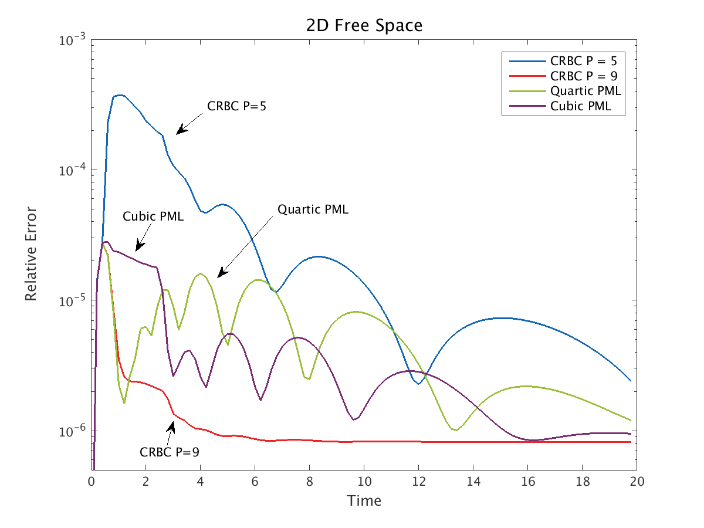
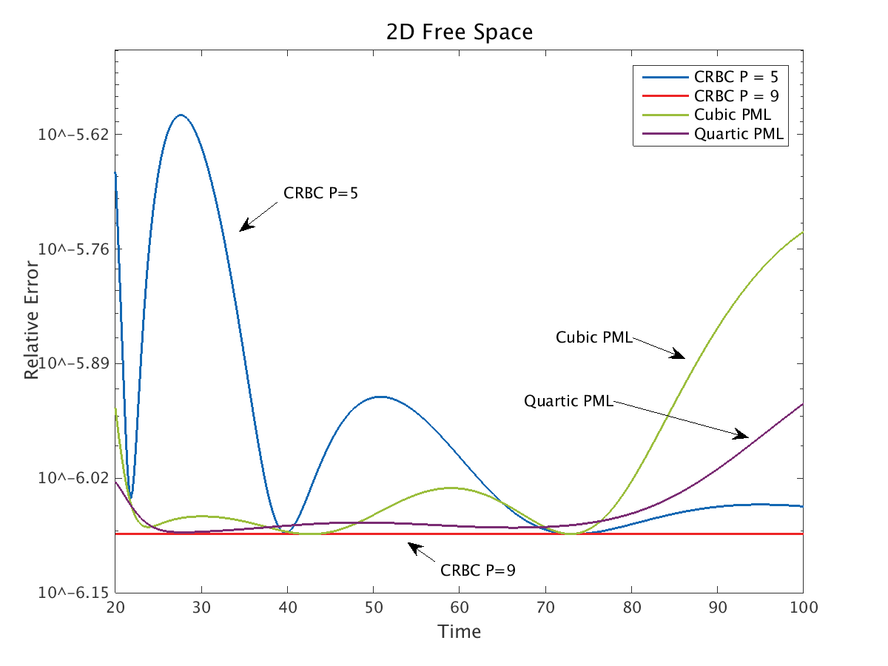
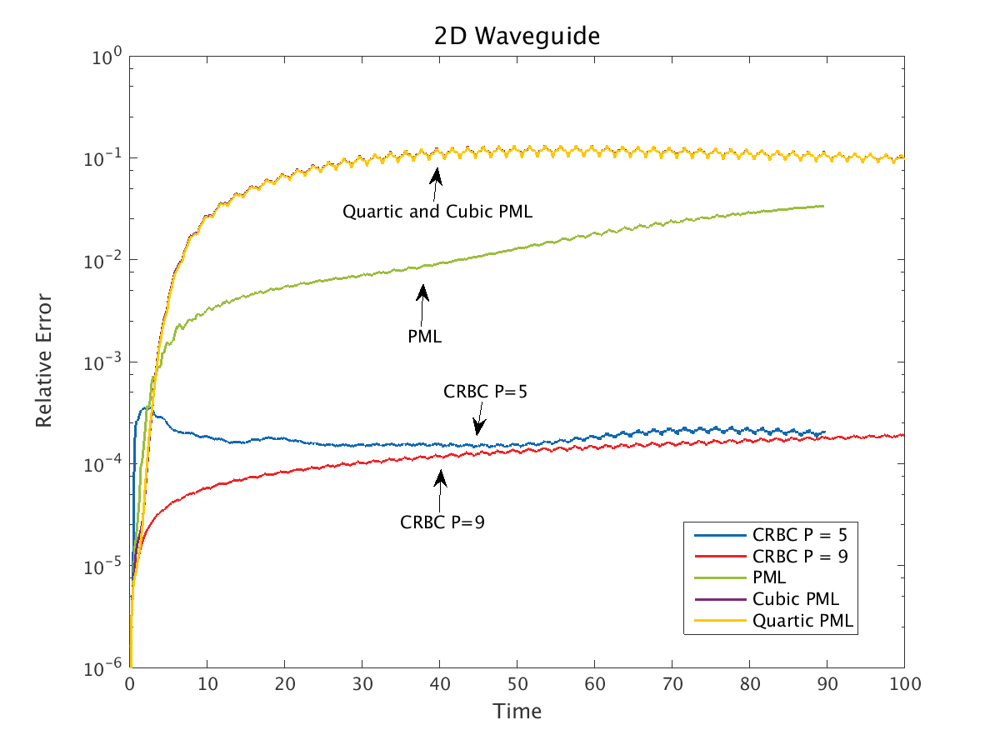
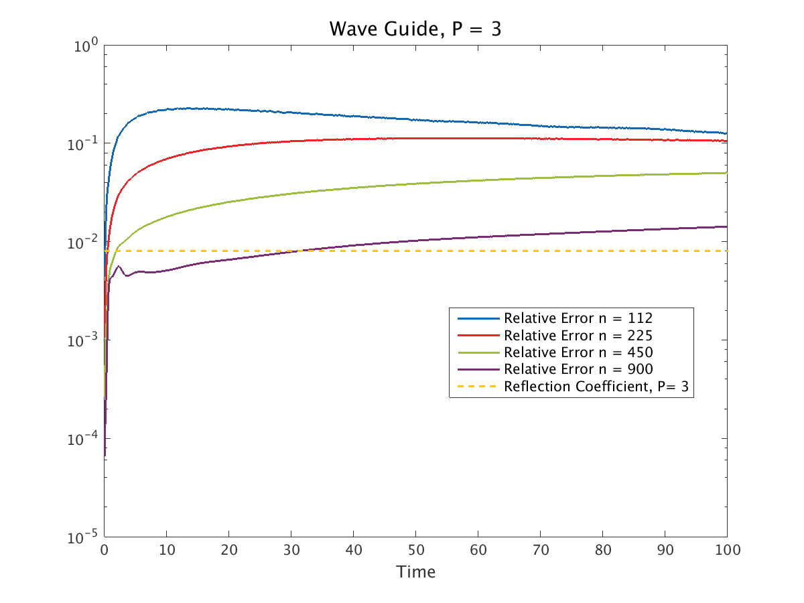
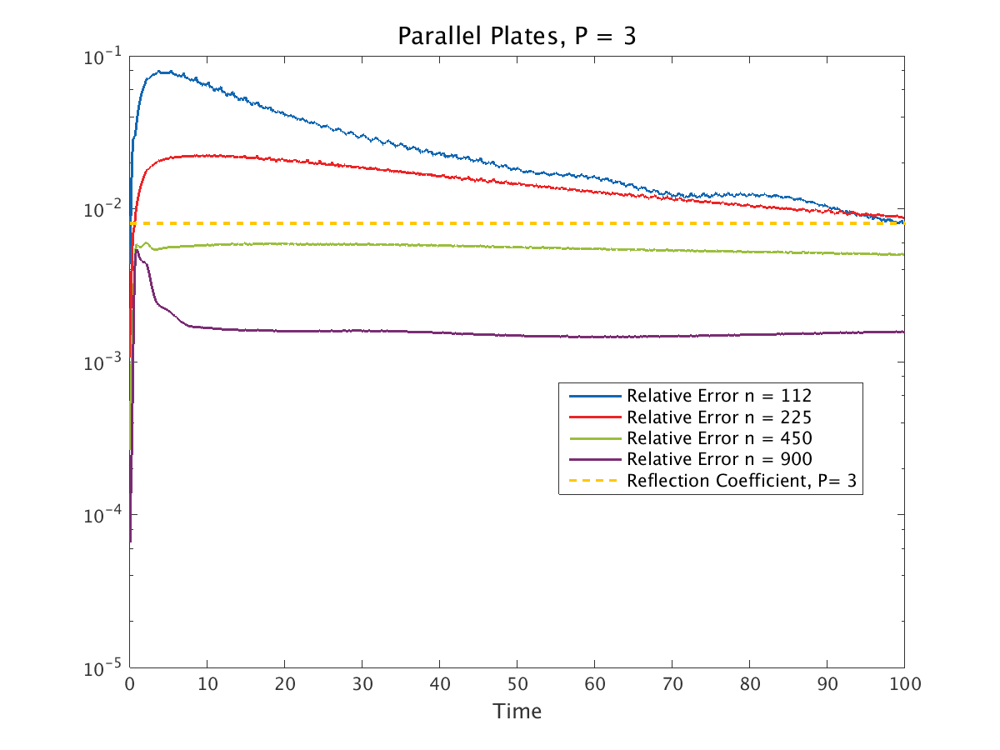
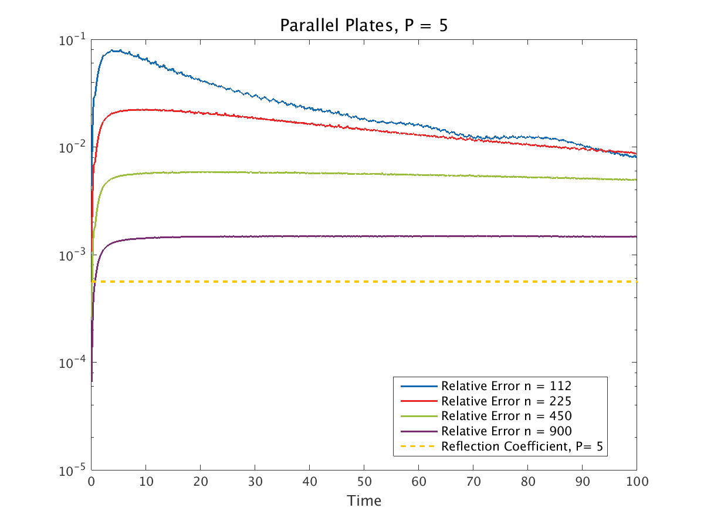
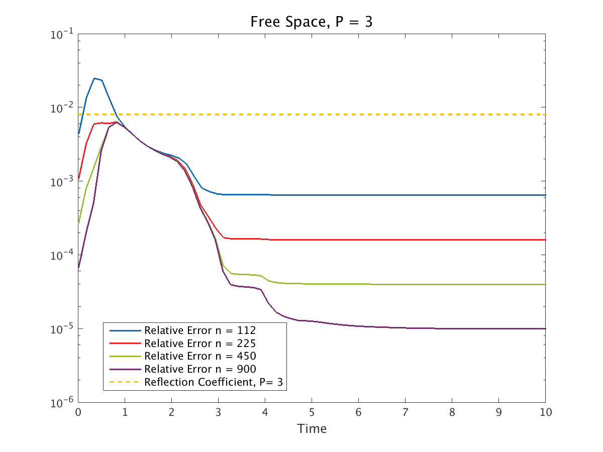
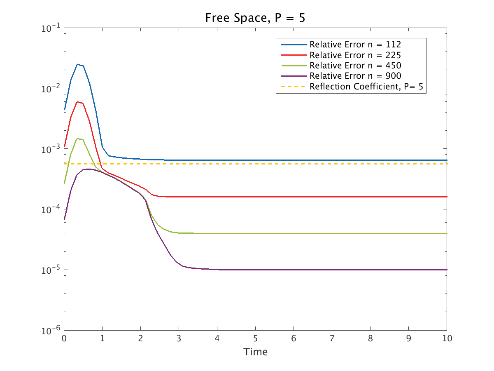
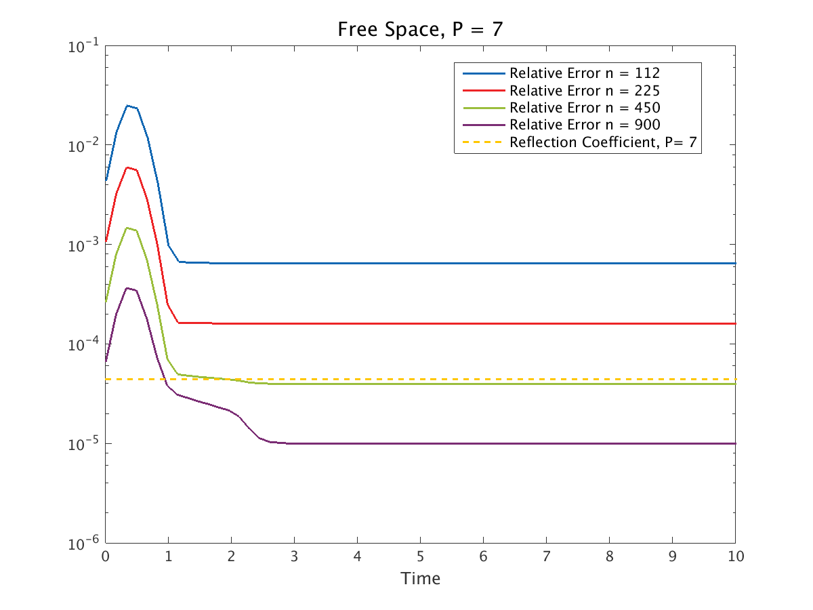
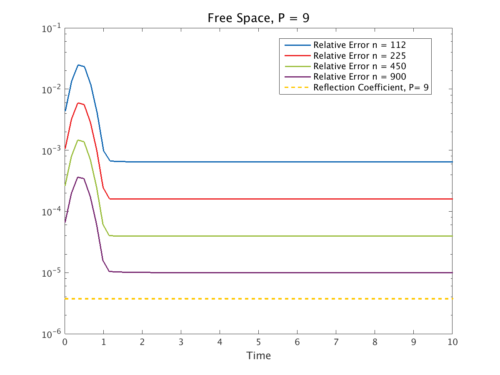

*****************
Numerical Results
*****************

.. _solutions:

Solutions
=========

In order to test our method, we will construct exact solutions to Maxwell's
Equations that satisfy our assumptions.
Namely, we wish to construct solution that satisfies the divergence free constraint
that is, at least numerically, compactly supported.

2D solution
-----------

We use the solution to the transverse magnetic problem given by

.. math::
  :nowrap:

  \begin{align}
      E_z = \mu \frac{\partial \phi}{\partial t}, \qquad H_x = - 
      \frac{\partial \phi}{\partial y}, \qquad H_y = \frac{\partial \phi}{\partial x},
  \end{align}

where :math:`\phi` is a solution of the scalar wave equation produced 
by a point source with the time amplitude :math:`e^{-125(t + .475)^2}`.
This solution is computed numerically to at least 10 digits. An end-point corrected
quadrature scheme to deal with the singularity in the Green's function for the 
wave equation in 2D. Boundary conditions are satisfied using the method of images.

Derivation of a 3D solution
---------------------------

If we choose :math:`\mathbf{W}` to be a solution to the wave equation with speed 
:math:`c = \frac{1}{\sqrt{\varepsilon \mu}}`, then we can ensure that our 
solution is divergence free by defining

.. math::
  :nowrap:

  \begin{align}
    \mathbf{A} = \nabla \times \mathbf{W} =
    \begin{bmatrix}
      \frac{\partial w_3}{\partial y} - \frac{\partial w_2}{\partial z} \\
      -\frac{\partial w_1}{\partial z} + \frac{\partial w_3}{\partial x} \\
      \frac{\partial w_1}{\partial y} - \frac{\partial w_2}{\partial x}
    \end{bmatrix}\label{curl_we}.
  \end{align}

Then, we can define

.. math::
  :nowrap:

  \begin{align}
    \mathbf{E} &= -\mu \frac{\partial A}{\partial t} = - \mu (\nabla \times \mathbf{W}_t) ,\label{E_def} \\
    \mathbf{H} &= \nabla \times A \label{H_def}.
  \end{align}

Since :math:`\mathbf{W}` satisfies the wave equation by assumption, we have

.. math::
  :nowrap:

  \begin{align}
    \mathbf{A}_{tt} = \frac{1}{\varepsilon \mu} \nabla^2 \mathbf{A},
  \end{align}

therefore,

.. math::
  :nowrap:
 
  \begin{align}
    \mathbf{E}_t = - \mu (\nabla \times \mathbf{A}_{tt}) = -\frac{1}{\varepsilon}  (\nabla \times \nabla^2 \mathbf{A}).
  \end{align}

Using the vector identity 
:math:`\nabla^2 \mathbf{A} = \nabla (\nabla \cdot \mathbf{A}) - \nabla \times (\nabla \times \mathbf{A})`, 
we have

.. math::
  :nowrap:

  \begin{align}
    \mathbf{E}_t & = - \frac{1}{\varepsilon} (\nabla \times (\nabla (\nabla \cdot \mathbf{A}))) 
                  + \frac{1}{\varepsilon} (\nabla \times (\nabla \times A)) \\
    & = \frac{1}{\varepsilon}(\nabla \times \mathbf{H}).
  \end{align}

Similarly, we have

.. math::
  :nowrap:

  \begin{align}
    \mathbf{H}_t = \nabla \times \mathbf{A}_{t} = - \frac{1}{\mu} (\nabla \times \mathbf{E}),
  \end{align}

So we see Maxwell's equations are satisfied. Furthermore, we can guarantee that 
our solution is compactly supported, as desired, with a careful choice of :math:`\mathbf{W}`.

Satisfying Boundary Conditions
^^^^^^^^^^^^^^^^^^^^^^^^^^^^^^

We can satisfy boundary conditions using the method of images. 
To illustrate this, we want consider the 3D waveguide problem in the domain

.. math::
  :nowrap:
 
  \begin{align}
    -\infty &< x < \infty, \\
    0 &< y < y_{max}, \\
    0 &< z < z_{max},
  \end{align}

with PEC boundary conditions at :math:`y = 0`, :math:`y = a`, :math:`z = 0`, and
:math:`z = b`. 

In order to satisfy the PEC boundary conditions at :math:`z=0` and 
:math:`z=z_{max}`, we have

.. math::
  :nowrap:

  \begin{align}
    \hat{\mathbf{n}} \times \mathbf{E} = -\frac{\partial}{\partial t}
    \begin{bmatrix}
      \frac{\partial w_1}{\partial z} - \frac{\partial w_3}{\partial x} \\
      \frac{\partial w_3}{\partial y} - \frac{\partial w_2}{\partial z} \\
      0
    \end{bmatrix},
  \end{align}

therefore, we require :math:`w_1` to be even in :math:`z`, :math:`w_2` to be 
even in z, and :math:`w_3` to be odd in :math:`z`. Similarly, we have

.. math::
  :nowrap:

  \begin{align}
    \hat{\mathbf{n}} \times \mathbf{E} = -\frac{\partial}{\partial t}
    \begin{bmatrix}
      \frac{\partial w_1}{\partial y} - \frac{\partial w_2}{\partial x} \\
      0 \\
      \frac{-\partial w_3}{\partial y} + \frac{\partial w_2}{\partial z}
    \end{bmatrix},
  \end{align}

for the PEC boundary conditions at :math:`y=0` and :math:`y=y_{max}`, 
so we will require :math:`w_1` to be even in :math:`y`, :math:`w_2` to be odd in
:math:`y`, and :math:`w_3` to be even in :math:`y`.

Finally, given a source location we can enforce these conditions by adding 
images of the appropriate source components (with the appropriate signs) which
have been reflected across the boundaries. 

Implementation Detail
^^^^^^^^^^^^^^^^^^^^^

In the implementation of out test problems, we choose all three components of
:math:`\mathbf{W}` to be

.. math::
  :nowrap:
  
  \begin{align}
    w \equiv w_1 = w_2 = w_3 = \frac{e^{-\gamma (t + \tau - r)^2}}{r},
  \end{align}

where :math:`r = \sqrt{(x_1-x_{1_{src}})^2 + (x_2-x_{2_{src}})^2 +(x_3-x_{3_{src}})^2}`
and :math:`\tau > 0`.
It is easy to verify that this is a point source solution of the wave equation. 
Noting that :math:`e^{-36} \approx 2.3195 \cdot 10^{-16}`, we can derive approximate 
bounds for the minimum and maximum distances the image sources can be from a given
point and contribute to the solution at that point. 
Based on the chosen form, numerically, we will see no contributions if 
the following is true

.. math::
  :nowrap:

  \begin{align}
    \left| t + \tau -r \right| \sqrt{\gamma} > 6.
  \end{align}
 
This implies that we only need to consider the image sources in the region given 
by

.. math::
  :nowrap:

  \begin{align}
    t + \tau - \frac{6}{\sqrt{\gamma}} < r < t + \tau + \frac{6}{\sqrt{\gamma}}.
  \end{align}

In practice, we first generate possible source locations in the looser bounds
given by inscribing a box in the lower bound and inscribing the upper bound in a box. 
After generating the possible locations, we then check these possibilities against 
the bound and only keep the sources that contribute.

When using this routine to generate initial conditions for simulations using the 
Yee scheme, we compute the curl numerically using the same discrete curl operator
that is used in the Yee updates.
This gives us initial conditions that are numerically divergence free for the 
simulations.
Furthermore, comparing the initial conditions computed using the
discrete and analytical divergence operators gives us a good approximation
of the discretization error we expect in the simulations.

Free Space Transverse Magnetic Problem
======================================

We simulated the free space transverse magnetic problem given by 

.. math::
  :nowrap:

  \begin{align}
    E_z = \mu \frac{\partial \phi}{\partial t}, \qquad H_x = - 
          \frac{\partial \phi}{\partial y}, \qquad H_y = \frac{\partial \phi}{\partial x},
  \end{align}

where :math:`\phi` is a solution of the scalar wave equation produced 
by a point source centered at :math:`(0, 0)` with the time amplitude 
:math:`e^{-125(t + .475)^2}`. 
The CRBC/DAB boundaries were placed at :math:`x=\pm 1` and :math:`y=\pm 1`.
For this test, we used a grid size of :math:`3000 \times 3000` in the :math:`E_z`
component.
The errors reported are relative to the initial condition and
are given by the following formula

.. math::
  :nowrap:

  \begin{align}
    \text{Relative Error at } t_n = \sqrt{\frac{\varepsilon \left\|
       \mathbf{E}_{\text{approx}}^{n} - \mathbf{E}_  {\text{exact}}^{n} \right\|^2_2
       + \mu \left\| \mathbf{H}_{\text{approx}}^{n} - \mathbf{H}_{\text{exact}}^{n} 
       \right\|^2_2}{\varepsilon \left\| \mathbf{E}_{\text{exact}}^{0} \right\|^2_2 
       + \mu \left\|  \mathbf{H}_{\text{exact}}^{0} \right\|^2_2}}
  \end{align}

For comparison purposes we also ran the simulation using a convolution
PML (CPML) with suggested parameters from the literature. We note that it is 
likely possible to find a set of parameters for the CPML that will perform better
than those presented for this problem. For these tests, we used a PML 10 Yee
cells thick and tried cubic and quartic ramping functions.

In the following plot showing :ref:`fig_2d_free_short`, we can  see that 
it is possible to get comparable results for both the CRBC/DAB
boundaries and the CPML boundaries, depending on the chosen parameters. 
In the following plot showing :ref:`fig_2d_free_long`, it appears that
the both boundaries have practically identical behaviors.

.. _fig_2d_free_short:

   behavior at short times

   Relative Error in Free Space for the Transverse Magnetic Test Problem.

.. _fig_2d_free_long:

   behavior at long times
 
   Relative Error in Free Space for the Transverse Magnetic Test Problem.

Finally, the following table summarizes the simulation results.

+--------------------------+----------------------------+-------------+-----------------------------+
| Grid                     | DOFs                       | BC          | Max Rel Err                 |
+==========================+============================+=============+=============================+
| :math:`3000 \times 3000` | :math:`2.72 \times 10^{7}` | CRBC P = 5  | :math:`3.73 \times 10^{-4}` |
+--------------------------+----------------------------+-------------+-----------------------------+
| :math:`3000 \times 3000` | :math:`2.73 \times 10^{7}` | CRBC P = 9  | :math:`2.76 \times 10^{-5}` |
+--------------------------+----------------------------+-------------+-----------------------------+
| :math:`3020 \times 3020` | :math:`2.77 \times 10^{7}` | Cubic PML   | :math:`2.76 \times 10^{-5}` |
+--------------------------+----------------------------+-------------+-----------------------------+
| :math:`3020 \times 3020` | :math:`2.77 \times 10^{7}` | Quartic PML | :math:`2.80 \times 10^{-5}` |
+--------------------------+----------------------------+-------------+-----------------------------+

Transverse Magnetic in a Wave Guide
===================================

To test these boundary conditions, we again simulated the transverse magnetic 
problem given by

.. math::
  :nowrap:

   \begin{align}
     E_z = \mu \frac{\partial \phi}{\partial t}, \qquad H_x = - \frac{\partial \phi}{\partial y},
       \qquad H_y = \frac{\partial \phi}{\partial x},
   \end{align}

where :math:`\phi` is a solution of the scalar wave equation satisfying 
zero Dirichlet (PEC) boundary conditions at :math:`y=0` and :math:`y=1` produced 
by a point source centered at :math:`(0, 0.1)` with a time 
amplitude :math:`e^{-125(t + .475)^2 }`. 
The CRBC/DAB and PML boundaries were placed at :math:`x=\pm 1` and the grid was 
:math:`6000 \times 3000` in the :math:`E_z` component.

The errors reported are relative to the initial condition and
are given by the following formula

.. math::
  :nowrap:

  \begin{align}
     \text{Relative Error at } t_n = \sqrt{\frac{\varepsilon \left\|
       \mathbf{E}_{\text{approx}}^{n} - \mathbf{E}_  {\text{exact}}^{n} \right\|^2_2
       + \mu \left\| \mathbf{H}_{\text{approx}}^{n} - \mathbf{H}_{\text{exact}}^{n} 
       \right\|^2_2}{\varepsilon \left\| \mathbf{E}_{\text{exact}}^{0} \right\|^2_2 
       + \mu \left\|  \mathbf{H}_{\text{exact}}^{0} \right\|^2_2}}
  \end{align}

For comparison purposes we also ran the simulation using a convolution
PML (CPML) with suggested parameters from the literature. We note that it is 
likely possible to find a set of parameters for the CPML that will perform better
than those presented for this problem. For these tests, we used a PML 10 Yee
cells thick and tried cubic and quartic ramping functions. The final run
labeled "PML" corresponds to choosing the PML parameter :math:`\sigma_{max}` to be 
approximately twice as large as suggested with quartic ramping.

In :ref:`fig_2d_wg`, we see that the DAB boundaries perform much better than the PML.
Furthermore, we see that suggested parameter values for the PML sometimes perform
poorly.

.. _fig_2d_wg:

   2D waveguide plot

   Relative Error for the Transverse Magnetic Test Problem in a Wave Guide.

Finally, the following table summarizes the simulation results.
  
+--------------------------+----------------------------+-------------+-----------------------------+
| Grid                     | DOFs                       | BC          | Max Rel Err                 |
+==========================+============================+=============+=============================+
| :math:`6000 \times 3000` | :math:`6.01 \times 10^{7}` | CRBC P = 5  | :math:`3.52 \times 10^{-4}` |
+--------------------------+----------------------------+-------------+-----------------------------+
| :math:`6000 \times 3000` | :math:`6.02 \times 10^{7}` | CRBC P = 9  | :math:`1.94 \times 10^{-4}` | 
+--------------------------+----------------------------+-------------+-----------------------------+
| :math:`6020 \times 3000` | :math:`6.04 \times 10^{7}` | PML         | :math:`3.37 \times 10^{-2}` | 
+--------------------------+----------------------------+-------------+-----------------------------+
| :math:`6020 \times 3000` | :math:`6.04 \times 10^{7}` | Cubic PML   | :math:`1.34 \times 10^{-1}` | 
+--------------------------+----------------------------+-------------+-----------------------------+
| :math:`6020 \times 3000` | :math:`6.04 \times 10^{7}` | Quartic PML | :math:`1.33 \times 10^{-1}` | 
+--------------------------+----------------------------+-------------+-----------------------------+  

3D Wave Guide
=============

Using a solution generated from a point source solution to the wave equation
with a Gaussian time amplitude as described in the :ref:`solutions section <solutions>`, we have tested our implementation
of the DAB boundaries on the domain :math:`[0,1.6] \times [0,1.6] \times [0,1.6]` with DAB 
boundaries at :math:`x = 0` and :math:`x =1.6` and PEC boundaries elsewhere. 
The source location was :math:`( 0.8, 0.8, 0.8)` and we used the solution parameters
:math:`\tau = 0.39` and :math:`\gamma = 130` with material parameters :math:`\epsilon = 0.8` and :math:`\mu = 1.25`.
The simulations were run with the CRBC parameter :math:`P = 3` and :math:`P = 5` on a grid with :math:`n` Yee 
cells in each spatial direction.

For the :math:`P = 3` case, we can see that we stay below the reflection coefficient for about a third of the simulation 
in the :ref:`fig_3d_wg_3`.
For the :math:`P = 5` case, we see approximately the same behavior as the :math:`P = 3`
case in the :ref:`fig_3d_wg_5`.
This behavior indicates that the discretization error is dominant in most cases and we believe the error at
later times can be explained by numerical dispersion.
  
.. _fig_3d_wg_3:

   3D waveguide plot (P = 3)

   Relative Error for a 3D wave guide simulation and and the expected reflection coefficients.

.. _fig_3d_wg_5:
.. figure:: images/wg_long_p=5.png
   :align: center
   :figwidth: 60 %
   :width: 90 %
   :alt: plot of relative error

   3D waveguide plot (P = 5)

   Relative Error for a 3D wave guide simulation and and the expected reflection coefficients.
     

Parallel Plates
===============

Using a solution generated from a point source solution to the wave equation
with a Gaussian time amplitude as described in the :ref:`solutions section <solutions>`, we have tested our implementation
of the DAB boundaries on the domain :math:`[0,1.6] \times [0,1.6] \times [0,1.6]` with PEC 
boundaries at :math:`z = 0` and :math:`z =1.6` and DAB boundaries elsewhere. 
The source location was :math:`( 0.8, 0.8, 0.8)` and we used the solution parameters
:math:`\tau = 0.39` and :math:`\gamma = 130` with material parameters :math:`\epsilon = 0.8` and :math:`\mu = 1.25`.
The simulations were run with the CRBC parameter :math:`P = 3` and :math:`P = 5` on a grid with :math:`n` Yee 
cells in each spatial direction.

Similar to the wave guide case, for the :math:`P = 3` case, we can see that we 
stay below the reflection coefficient when using a sufficiently refined grid 
in the :ref:`fig_3d_par_3`.
For the :math:`P = 5` case, we again see approximately the same behavior as the :math:`P = 3`
case in the :ref:`fig_3d_par_5`.
This behavior indicates that the discretization error is dominant in most cases.
Compared to the wave guide example, the better long time error behavior is due 
to the fact that more energy leaves the computational domain and the numerical
dispersion has less effect.

.. _fig_3d_par_3:

   3D parallel plates plot (P = 3)

   Relative Error for a 3D parallel plate simulation and and the expected reflection coefficients.

.. _fig_3d_par_5:

   3D parallel plates plot (P = 5)

   Relative Error for a 3D parallel plate simulation and and the expected reflection coefficients.
  
Free Space
==========

Again, using a solution generated from a point source solution to the wave equation
with a Gaussian time amplitude as described in the :ref:`solutions section <solutions>`, we have tested our implementation
of the DAB boundaries on the domain :math:`[0,1.6] \times [0,1.6] \times [0,1.6]` with DAB boundaries one all faces. 
The source location was :math:`( 0.8, 0.8, 0.8)` and we used the solution parameters
:math:`\tau = 0.39` and :math:`\gamma = 130` with material parameters :math:`\epsilon = 0.8` and :math:`\mu = 1.25`.
The simulations were run with the CRBC parameter :math:`P = 3` and :math:`P = 5` on a grid with :math:`n` Yee 
cells in each spatial direction.

For the free space simulation, we see that we are able to meet the error bounds provided by the 
expected reflection coefficients up to :math:`P=7`.
Looking at the :ref:`fig_3d_free_3`, we can see that relative error "steps" down
in a more or less regular pattern. This happens because some amount of the wave
front erroneously reflects off of the boundary and a large portion of this reflected
wave is absorbed when it reaches the opposite boundary.
We can see this behavior in the :ref:`fig_3d_free_5` and the :ref:`fig_3d_free_7`
and we note that in all of these cases the reflection coefficient is a good 
predictor of where this behavior occurs, as expected.
In the :ref:`fig_3d_free_9`, we see that the discretization error dominates 
and we never reach the reflection coefficient.
Finally, in the :ref:`fig_3d_free_7_long`, we show that relative error remains constant
over a long time (this occurs for all of the simulations, but we have omitted the
plots).
In these simulations, we believe the long time error are on the order of discretization error.

These plots also demonstrate that choosing the a tolerance so that a reflection
coefficient is approximately equal to the discretization error is a good choice.
For instance, we can see that :math:`P=5` is a good choice for :math:`n=112` and 
:math:`p=7` is a good choice for :math:`n=450`.

.. _fig_3d_free_3:

   3D free space plot (P = 3)

   Relative Error for a 3D free space simulation and the expected reflection coefficients.

.. _fig_3d_free_5:

   3D free space plot (P = 5)

   Relative Error for a 3D free space simulation and the expected reflection coefficients.

.. _fig_3d_free_7:

   3D free space plot (P = 7)

   Relative Error for a 3D free space simulation and the expected reflection coefficients.

.. _fig_3d_free_9:

   3D free space plot (P = 9)

   Relative Error for a 3D free space simulation and the expected reflection coefficients.

.. _fig_3d_free_7_long:
.. figure:: images/free_long_p=7.png
   :align: center
   :figwidth: 60 %
   :width: 90 %
   :alt: plot of relative error

   3D free space plot (long time, P = 7)

   Relative Error for a 3D free space simulation and the expected reflection coefficients.
